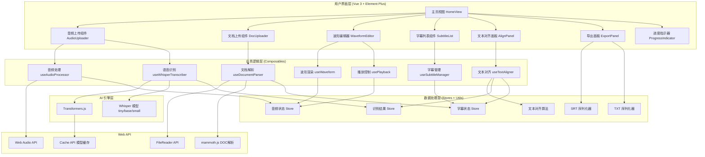
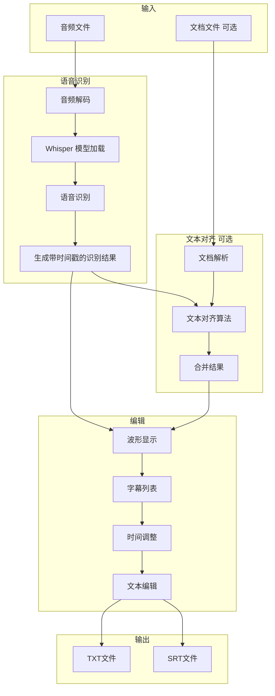
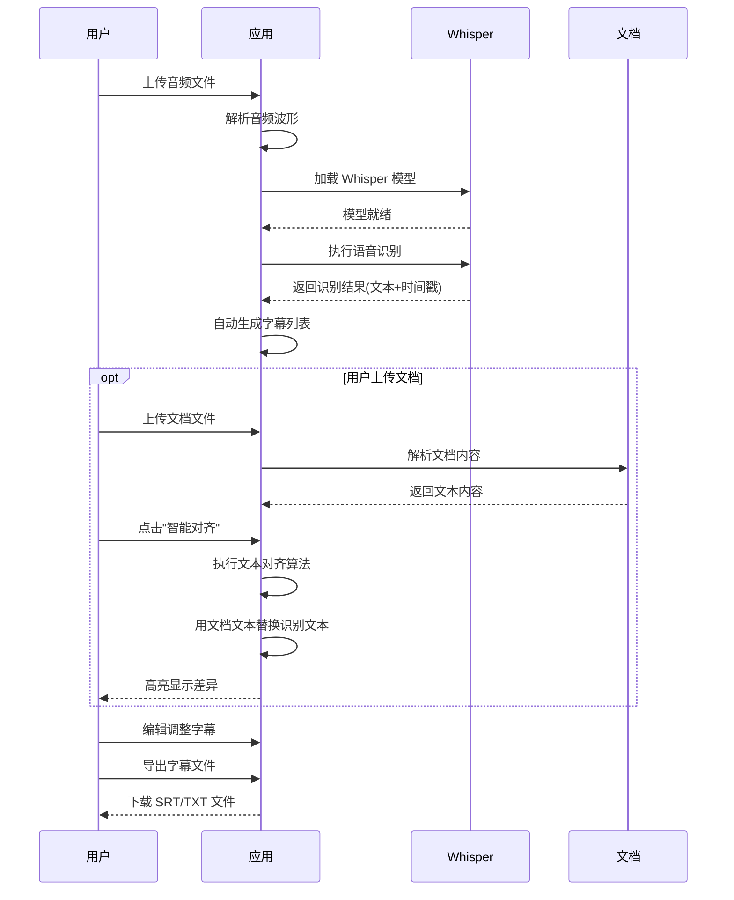

# 音频字幕生成器 - 技术设计文档

Feature Name: audio-subtitle-generator
Updated: 2026-03-10

## Description

音频字幕生成器是一个纯前端 Web 应用，基于 Vue 3 + Element Plus + Transformers.js 构建。用户上传音频文件后，应用使用 Whisper 模型进行语音识别，自动生成带精确时间戳的字幕；用户可选择上传文档文件，通过智能文本对齐算法修正识别结果。应用提供可视化波形编辑器进行微调，支持导出 SRT 和 TXT 格式字幕文件。

## Architecture

### 系统架构图



### 数据流程图



### 核心工作流程



## Components and Interfaces

### 目录结构

```
audio-subtitle-app/
├── index.html                    # HTML 入口
├── package.json                  # 项目配置
├── vite.config.js               # Vite 配置
├── src/
│   ├── main.js                  # 应用入口
│   ├── App.vue                  # 根组件
│   ├── views/
│   │   └── HomeView.vue         # 主页视图
│   ├── components/
│   │   ├── AudioUploader.vue    # 音频上传组件
│   │   ├── DocUploader.vue      # 文档上传组件
│   │   ├── WaveformEditor.vue   # 波形编辑器
│   │   ├── SubtitleItem.vue     # 字幕条目组件
│   │   ├── SubtitleList.vue     # 字幕列表组件
│   │   ├── AlignPanel.vue       # 文本对齐面板
│   │   ├── DiffViewer.vue       # 差异对比组件
│   │   ├── PlaybackControls.vue # 播放控制组件
│   │   ├── ExportPanel.vue      # 导出面板
│   │   ├── ModelSelector.vue    # 模型选择器
│   │   └── ProgressIndicator.vue# 进度指示器
│   ├── composables/
│   │   ├── useAudioProcessor.js # 音频处理 Hook
│   │   ├── useWhisperTranscriber.js # Whisper 识别 Hook
│   │   ├── useDocumentParser.js # 文档解析 Hook
│   │   ├── useTextAligner.js    # 文本对齐 Hook
│   │   ├── useSubtitleManager.js# 字幕管理 Hook
│   │   ├── usePlayback.js       # 播放控制 Hook
│   │   └── useWaveform.js       # 波形渲染 Hook
│   ├── stores/
│   │   ├── audioStore.js        # 音频状态
│   │   ├── subtitleStore.js     # 字幕状态
│   │   └── transcriptStore.js   # 识别结果状态
│   ├── utils/
│   │   ├── srtFormatter.js      # SRT 格式化
│   │   ├── txtFormatter.js      # TXT 格式化
│   │   ├── timeUtils.js         # 时间工具
│   │   ├── textAligner.js       # 文本对齐算法
│   │   └── diffHighlighter.js   # 差异高亮工具
│   ├── workers/
│   │   └── whisper.worker.js    # Whisper Web Worker
│   └── styles/
│       ├── variables.css        # CSS 变量
│       └── main.css             # 主样式文件
└── public/
    └── favicon.ico
```

### 核心组件接口

#### AudioUploader.vue

```typescript
interface AudioUploaderProps {
  acceptTypes: string[]       // 接受的文件类型
  maxSize: number            // 最大文件大小 (bytes)
}

interface AudioUploaderEmits {
  'upload-success': (file: AudioFile) => void
  'upload-error': (error: UploadError) => void
}

interface AudioFile {
  id: string
  name: string
  size: number
  type: string
  duration: number           // 音频时长
  file: File
}
```

#### WaveformEditor.vue

```typescript
interface WaveformEditorProps {
  audioBuffer: AudioBuffer    // 音频数据
  subtitles: Subtitle[]       // 字幕数据
  currentTime: number         // 当前播放时间
  isRecognizing: boolean      // 是否正在识别
}

interface WaveformEditorEmits {
  'time-select': (time: number) => void
  'region-select': (region: TimeRegion) => void
  'subtitle-add': (region: TimeRegion) => void
  'subtitle-select': (id: string) => void
}

interface TimeRegion {
  start: number              // 开始时间 (秒)
  end: number                // 结束时间 (秒)
}
```

#### SubtitleList.vue

```typescript
interface SubtitleListProps {
  subtitles: Subtitle[]
  currentTime: number
  activeId: string | null
  recognizedText: string      // 识别的原始文本（用于对比）
}

interface SubtitleListEmits {
  'update': (id: string, data: Partial<Subtitle>) => void
  'delete': (id: string) => void
  'select': (id: string) => void
}

interface Subtitle {
  id: string
  index: number
  startTime: number          // 开始时间 (秒)
  endTime: number            // 结束时间 (秒)
  text: string               // 字幕文本
  isModified: boolean        // 是否被修改（用于高亮差异）
}
```

#### AlignPanel.vue

```typescript
interface AlignPanelProps {
  recognizedText: string     // Whisper 识别的文本
  documentText: string       // 文档解析的文本
  subtitles: Subtitle[]      // 当前字幕列表
}

interface AlignPanelEmits {
  'align': (result: AlignResult) => void
  'cancel': () => void
}

interface AlignResult {
  subtitles: Subtitle[]      // 对齐后的字幕列表
  diffItems: DiffItem[]      // 差异列表
}

interface DiffItem {
  type: 'add' | 'delete' | 'modify'
  originalText: string
  alignedText: string
  subtitleId: string
}
```

### Composables 接口

#### useWhisperTranscriber

```typescript
interface WhisperTranscriber {
  // 状态
  isModelLoading: Ref<boolean>
  isTranscribing: Ref<boolean>
  progress: Ref<number>           // 进度 0-100
  error: Ref<string | null>
  modelLoaded: Ref<boolean>
  currentModel: Ref<string>

  // 方法
  loadModel(modelName: 'tiny' | 'base' | 'small' | 'medium'): Promise<void>
  transcribe(audioBuffer: AudioBuffer): Promise<TranscriptResult>
  abort(): void
  getAvailableModels(): string[]
  getCachedModels(): string[]
}

interface TranscriptResult {
  text: string                    // 完整识别文本
  chunks: TranscriptChunk[]       // 分段结果
  language: string                // 识别语言
}

interface TranscriptChunk {
  id: string
  text: string
  start: number                   // 开始时间 (秒)
  end: number                     // 结束时间 (秒)
  confidence: number              // 置信度 0-1
}
```

#### useTextAligner

```typescript
interface TextAligner {
  // 状态
  isAligning: Ref<boolean>
  error: Ref<string | null>

  // 方法
  align(recognized: TranscriptChunk[], documentText: string): Promise<AlignResult>
  highlightDiff(original: string, aligned: string): DiffItem[]
}

// 文本对齐算法实现
interface AlignAlgorithm {
  // 使用动态规划或序列匹配算法
  // 将文档文本与识别结果的分段时间戳对齐
}
```

#### useAudioProcessor

```typescript
interface AudioProcessor {
  // 状态
  audioBuffer: Ref<AudioBuffer | null>
  duration: Ref<number>
  isLoading: Ref<boolean>
  error: Ref<string | null>

  // 方法
  loadAudio(file: File): Promise<void>
  getWaveformData(width: number): Float32Array
  play(): void
  pause(): void
  seek(time: number): void
  dispose(): void
}
```

#### useSubtitleManager

```typescript
interface SubtitleManager {
  // 状态
  subtitles: Ref<Subtitle[]>
  activeId: Ref<string | null>

  // 方法
  fromTranscript(chunks: TranscriptChunk[]): void
  updateSubtitle(id: string, data: Partial<Subtitle>): void
  deleteSubtitle(id: string): void
  addSubtitle(start: number, end: number, text: string): void
  reorderSubtitles(): void
  applyAlignResult(result: AlignResult): void
}
```

## Data Models

### 识别结果数据模型

```typescript
interface TranscriptStore {
  rawText: string                 // 原始识别文本
  chunks: TranscriptChunk[]       // 分段结果
  language: string                // 识别语言
  model: string                   // 使用的模型
  timestamp: number               // 识别时间
}

interface TranscriptChunk {
  id: string
  text: string
  start: number                   // 开始时间 (秒)
  end: number                     // 结束时间 (秒)
  confidence: number              // 置信度 0-1
}
```

### 字幕数据模型

```typescript
interface Subtitle {
  id: string                      // 唯一标识符 (UUID)
  index: number                   // 序号 (导出时使用)
  startTime: number               // 开始时间 (秒，精确到毫秒)
  endTime: number                 // 结束时间 (秒，精确到毫秒)
  text: string                    // 字幕文本内容
  isModified: boolean             // 是否被用户修改
  source: 'whisper' | 'document' | 'manual'  // 来源
}

interface SubtitleStore {
  subtitles: Subtitle[]
  activeId: string | null
  editingId: string | null
}
```

### 音频数据模型

```typescript
interface AudioStore {
  file: File | null
  audioBuffer: AudioBuffer | null
  duration: number
  currentTime: number
  isPlaying: boolean
  waveformData: Float32Array | null
}
```

### 文档数据模型

```typescript
interface DocumentStore {
  file: File | null
  content: string
  paragraphs: string[]            // 按段落分割的文本
}
```

## Correctness Properties

### 时间约束

1. **时间有效性**: 所有字幕的 `startTime` 和 `endTime` 必须满足 `0 <= startTime < endTime <= audioDuration`
2. **时间非重叠**: 相邻字幕的时间范围不应重叠（允许有间隙）
3. **时间排序**: 字幕列表必须按 `startTime` 升序排列
4. **时间戳继承**: 文本对齐后，字幕的时间戳必须来自原始识别结果

### 文本约束

1. **文本非空**: 每条字幕的 `text` 不能为空字符串
2. **文本长度**: 单条字幕文本建议不超过 84 个字符（标准字幕规范）
3. **字符编码**: 导出文件使用 UTF-8 编码
4. **对齐完整性**: 文本对齐后，所有文档内容都应被分配到字幕中

### 格式约束

1. **SRT 时间格式**: `HH:MM:SS,mmm`（逗号分隔毫秒）
2. **SRT 序号**: 从 1 开始连续编号

### 模型约束

1. **模型缓存**: 下载的模型应缓存在浏览器 Cache API 中
2. **模型选择**: 首次使用默认 tiny 模型，用户可选择更精确的模型
3. **内存管理**: 处理完成后应及时释放模型内存

## Error Handling

### 错误类型定义

```typescript
enum AppErrorType {
  FILE_TYPE_INVALID = 'FILE_TYPE_INVALID',
  FILE_SIZE_EXCEEDED = 'FILE_SIZE_EXCEEDED',
  AUDIO_DECODE_FAILED = 'AUDIO_DECODE_FAILED',
  DOCUMENT_PARSE_FAILED = 'DOCUMENT_PARSE_FAILED',
  MODEL_LOAD_FAILED = 'MODEL_LOAD_FAILED',
  TRANSCRIPTION_FAILED = 'TRANSCRIPTION_FAILED',
  ALIGNMENT_FAILED = 'ALIGNMENT_FAILED',
  EXPORT_FAILED = 'EXPORT_FAILED',
  NO_SPEECH_DETECTED = 'NO_SPEECH_DETECTED',
}

interface AppError {
  type: AppErrorType
  message: string
  detail?: string
  retryable: boolean
}
```

### 错误处理策略

| 错误类型 | 处理方式 | 用户提示 | 可重试 |
|---------|---------|---------|--------|
| FILE_TYPE_INVALID | 阻止上传 | "不支持的文件格式" | 否 |
| FILE_SIZE_EXCEEDED | 阻止上传 | "文件大小超过限制" | 否 |
| AUDIO_DECODE_FAILED | 提示重试 | "音频解码失败" | 是 |
| DOCUMENT_PARSE_FAILED | 提示详情 | "文档解析失败" | 否 |
| MODEL_LOAD_FAILED | 提供重试 | "模型加载失败，请检查网络" | 是 |
| TRANSCRIPTION_FAILED | 提供重试 | "语音识别失败" | 是 |
| ALIGNMENT_FAILED | 提供重试 | "文本对齐失败" | 是 |
| NO_SPEECH_DETECTED | 提示用户 | "未检测到语音内容" | 否 |

### 错误边界组件

```vue
<template>
  <el-alert
    v-if="error"
    :title="error.message"
    :description="error.detail"
    :type="error.retryable ? 'warning' : 'error'"
    show-icon
    closable
    @close="clearError"
  >
    <template #default v-if="error.retryable">
      <el-button size="small" @click="retry">重试</el-button>
    </template>
  </el-alert>
</template>
```

## Test Strategy

### 单元测试

使用 Vitest 进行单元测试：

```javascript
describe('textAligner', () => {
  it('should align document text with transcript chunks', () => {
    const chunks = [
      { id: '1', text: '大家好今天天气很好', start: 0, end: 2 },
      { id: '2', text: '我们来讨论人工智能', start: 2, end: 4 },
    ]
    const documentText = '大家好，今天天气很好。我们来讨论人工智能的发展。'
    const result = align(chunks, documentText)

    expect(result.subtitles).toHaveLength(2)
    expect(result.subtitles[0].text).toBe('大家好，今天天气很好。')
    expect(result.subtitles[0].startTime).toBe(0)
    expect(result.subtitles[0].endTime).toBe(2)
  })

  it('should highlight differences between recognized and aligned text', () => {
    const original = '大家好今天天气很好'
    const aligned = '大家好，今天天气很好。'
    const diff = highlightDiff(original, aligned)

    expect(diff).toContainEqual({
      type: 'add',
      position: 3,
      char: '，'
    })
  })
})

describe('srtFormatter', () => {
  it('should format subtitle to SRT correctly', () => {
    const subtitle = {
      id: '1',
      index: 1,
      startTime: 1.5,
      endTime: 4.2,
      text: 'Hello World'
    }
    const result = formatToSRT(subtitle)
    expect(result).toBe(
      '1\n00:00:01,500 --> 00:00:04,200\nHello World\n'
    )
  })
})
```

### 组件测试

```javascript
describe('WhisperTranscriber', () => {
  it('should load whisper model successfully', async () => {
    const { loadModel, modelLoaded } = useWhisperTranscriber()
    await loadModel('tiny')
    expect(modelLoaded.value).toBe(true)
  })

  it('should transcribe audio and return chunks with timestamps', async () => {
    const { transcribe } = useWhisperTranscriber()
    const result = await transcribe(mockAudioBuffer)

    expect(result.text).toBeDefined()
    expect(result.chunks).toBeDefined()
    result.chunks.forEach(chunk => {
      expect(chunk.start).toBeGreaterThanOrEqual(0)
      expect(chunk.end).toBeGreaterThan(chunk.start)
    })
  })
})
```

### 集成测试场景

1. **完整流程测试**: 上传音频 → 语音识别 → 生成字幕 → 编辑 → 导出
2. **文本对齐测试**: 上传音频 → 识别 → 上传文档 → 对齐 → 验证结果
3. **格式兼容性测试**: 测试所有支持的音频和文档格式
4. **边界条件测试**: 空音频、无语音音频、超大文件、特殊字符处理

## UI Design

### 界面布局

```
+----------------------------------------------------------+
|  Logo  音频字幕生成器          [模型: tiny v] [帮助]      |
+----------------------------------------------------------+
|                                                          |
|  +----------------------------------------------------+  |
|  |              音频上传区域                           |  |
|  |        [拖拽音频文件到此处或点击上传]              |  |
|  +----------------------------------------------------+  |
|                                                          |
+----------------------------------------------------------+
|  识别状态: [████████████░░░░░░░░] 60% 正在识别中...      |
+----------------------------------------------------------+
|  [▶播放] [⏸暂停] [停止]  ▬▬▬▬▬○▬▬▬▬▬  00:00 / 05:30     |
+----------------------------------------------------------+
|                                                          |
|  +----------------------------------------------------+  |
|  |              波形编辑器                             |  |
|  |  ▁▂▃▄▅▆▇█▇▆▅▄▃▂▁▁▂▃▄▅▆▇█▇▆▅▄▃▂▁                 |  |
|  |  |字幕1|    |字幕2|      |字幕3|                  |  |
|  |  ▼      当前播放位置                                 |  |
|  +----------------------------------------------------+  |
|                                                          |
+----------------------------------------------------------+
|  字幕列表 (识别结果)              [+添加] [上传文档修正] |
|  +----------------------------------------------------+  |
|  | #1  00:00:01.000 --> 00:00:03.500  [编辑] [删除]  |  |
|  |     大家好，今天天气很好。                          |  |
|  +----------------------------------------------------+  |
|  | #2  00:00:03.500 --> 00:00:06.000  [编辑] [删除]  |  |
|  |     我们来讨论人工智能的发展。                      |  |
|  +----------------------------------------------------+  |
|                                                          |
+----------------------------------------------------------+
|                                    [导出 SRT] [导出 TXT] |
+----------------------------------------------------------+

--- 文档上传后的对齐界面 ---

+----------------------------------------------------------+
|  智能对齐                                                 |
+----------------------------------------------------------+
|  原始识别                    |  文档内容                   |
|  ---------------------------|---------------------------  |
|  大家好今天天气很好          |  大家好，今天天气很好。      |
|  我们来讨论人工智能          |  我们来讨论人工智能的发展。  |
+----------------------------------------------------------+
|  差异: + "，" + "。" + "的发展。"                         |
|                                                          |
|  [取消]                           [应用对齐结果]         |
+----------------------------------------------------------+
```

### 配色方案

```css
:root {
  /* 主色调 */
  --primary-color: #409EFF;
  --primary-hover: #66B1FF;

  /* 背景色 */
  --bg-color: #F5F7FA;
  --card-bg: #FFFFFF;
  --waveform-bg: #1A1A2E;

  /* 文字颜色 */
  --text-primary: #303133;
  --text-secondary: #909399;

  /* 波形颜色 */
  --waveform-color: #4FC3F7;
  --region-color: rgba(64, 158, 255, 0.3);
  --playhead-color: #FF5252;

  /* 字幕标记颜色 */
  --subtitle-marker: #409EFF;
  --subtitle-active: #67C23A;

  /* 状态色 */
  --success-color: #67C23A;
  --warning-color: #E6A23C;
  --error-color: #F56C6C;

  /* 差异高亮颜色 */
  --diff-add-bg: #E6FFEC;
  --diff-add-text: #22863A;
  --diff-delete-bg: #FFEBE9;
  --diff-delete-text: #CB2431;
  --diff-modify-bg: #FFF5B1;
}
```

### 响应式断点

```css
/* 桌面端 (>= 1200px) */
@media (min-width: 1200px) {
  .layout { flex-direction: column; }
  .waveform-editor { height: 300px; }
  .align-panel { display: grid; grid-template-columns: 1fr 1fr; }
}

/* 平板端 (768px - 1199px) */
@media (min-width: 768px) and (max-width: 1199px) {
  .layout { flex-direction: column; }
  .waveform-editor { height: 200px; }
  .align-panel { display: block; }
}

/* 移动端 (< 768px) */
@media (max-width: 767px) {
  .layout { flex-direction: column; }
  .waveform-editor { height: 150px; }
  .align-panel { display: block; font-size: 14px; }
}
```

## Technology Stack

### 前端框架

| 技术 | 版本 | 用途 |
|-----|------|-----|
| Vue 3 | 3.5.x | 前端框架 |
| Element Plus | 2.x | UI 组件库 |
| Pinia | 3.x | 状态管理 |
| Vue Router | 5.x | 路由管理 |

### 构建工具

| 技术 | 版本 | 用途 |
|-----|------|-----|
| Vite | 7.x | 构建工具 |
| Vitest | 4.x | 单元测试 |

### AI 引擎

| 技术 | 用途 |
|-----|-----|
| Transformers.js | 在浏览器中运行 ML 模型 |
| Whisper (tiny/base/small/medium) | OpenAI 语音识别模型 |

### 核心依赖

| 库名 | 用途 |
|-----|-----|
| mammoth.js | DOCX 文件解析 |
| uuid | 唯一 ID 生成 |
| diff-match-patch | 文本差异计算 |

### Web API 使用

| API | 用途 |
|-----|-----|
| Web Audio API | 音频解码、播放控制 |
| Canvas API | 波形渲染 |
| FileReader API | 文件读取 |
| Blob API | 文件下载 |
| Cache API | Whisper 模型缓存 |
| Web Worker | 后台执行语音识别 |

## Implementation Notes

### Whisper 模型集成

使用 Transformers.js 加载和运行 Whisper 模型：

```javascript
import { pipeline } from '@xenova/transformers';

async function loadWhisper(modelName = 'tiny') {
  const transcriber = await pipeline(
    'automatic-speech-recognition',
    `Xenova/whisper-${modelName}`,
    { progress_callback: onProgress }
  );
  return transcriber;
}

async function transcribe(transcriber, audioBuffer) {
  const result = await transcriber(audioBuffer, {
    chunk_length_s: 30,
    stride_length_s: 5,
    return_timestamps: true,
    language: 'chinese',
  });

  return {
    text: result.text,
    chunks: result.chunks.map((chunk, i) => ({
      id: generateId(),
      text: chunk.text.trim(),
      start: chunk.timestamp[0],
      end: chunk.timestamp[1],
      confidence: chunk.confidence || 1,
    })),
  };
}
```

### 文本对齐算法

使用基于序列匹配的对齐算法：

```javascript
import DiffMatchPatch from 'diff-match-patch';

function alignText(transcriptChunks, documentText) {
  const dmp = new DiffMatchPatch();

  // 1. 合并所有识别文本
  const recognizedText = transcriptChunks.map(c => c.text).join('');

  // 2. 计算差异
  const diffs = dmp.diff_main(recognizedText, documentText);
  dmp.diff_cleanupSemantic(diffs);

  // 3. 根据差异和时间戳生成对齐后的字幕
  let charIndex = 0;
  const alignedSubtitles = [];

  for (const chunk of transcriptChunks) {
    const chunkStart = charIndex;
    const chunkEnd = charIndex + chunk.text.length;

    // 找到对应位置的文档文本
    const alignedText = extractAlignedText(diffs, chunkStart, chunkEnd);

    alignedSubtitles.push({
      id: generateId(),
      startTime: chunk.start,
      endTime: chunk.end,
      text: alignedText,
      source: 'aligned',
    });

    charIndex = chunkEnd;
  }

  return alignedSubtitles;
}
```

### 波形渲染优化

1. **采样降频**: 对长音频进行采样，降低渲染点数
2. **虚拟滚动**: 波形区域只渲染可见部分
3. **离屏渲染**: 使用 OffscreenCanvas 提高性能
4. **防抖处理**: 缩放和滚动操作添加防抖

### SRT 格式化

```javascript
function formatTime(seconds) {
  const h = Math.floor(seconds / 3600)
  const m = Math.floor((seconds % 3600) / 60)
  const s = Math.floor(seconds % 60)
  const ms = Math.floor((seconds % 1) * 1000)
  return `${pad(h, 2)}:${pad(m, 2)}:${pad(s, 2)},${pad(ms, 3)}`
}

function formatToSRT(subtitles) {
  return subtitles.map((sub, index) =>
    `${index + 1}\n${formatTime(sub.startTime)} --> ${formatTime(sub.endTime)}\n${sub.text}\n`
  ).join('\n')
}
```

### 模型缓存策略

```javascript
// 使用 Cache API 缓存 Whisper 模型
async function cacheModel(modelName, modelData) {
  const cache = await caches.open('whisper-models');
  await cache.put(
    `whisper-${modelName}`,
    new Response(modelData)
  );
}

async function getCachedModel(modelName) {
  const cache = await caches.open('whisper-models');
  const response = await cache.match(`whisper-${modelName}`);
  return response ? response.arrayBuffer() : null;
}
```

## References

- [Transformers.js - GitHub](https://github.com/xenova/transformers.js)
- [whisper-web - GitHub](https://github.com/xenova/whisper-web)
- [whisper.cpp - GitHub](https://github.com/ggerganov/whisper.cpp)
- [Web Audio API - MDN](https://developer.mozilla.org/en-US/docs/Web/API/Web_Audio_API)
- [SRT File Format Specification](https://en.wikipedia.org/wiki/SubRip#SubRip_file_format)
- [mammoth.js Documentation](https://github.com/mwilliamson/mammoth.js)
- [diff-match-patch - GitHub](https://github.com/google/diff-match-patch)
