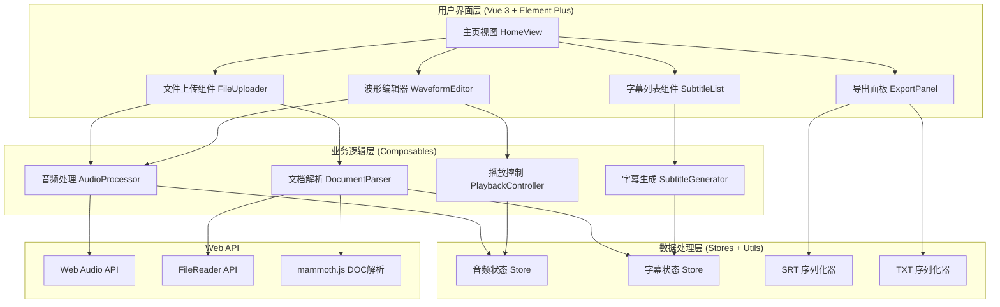
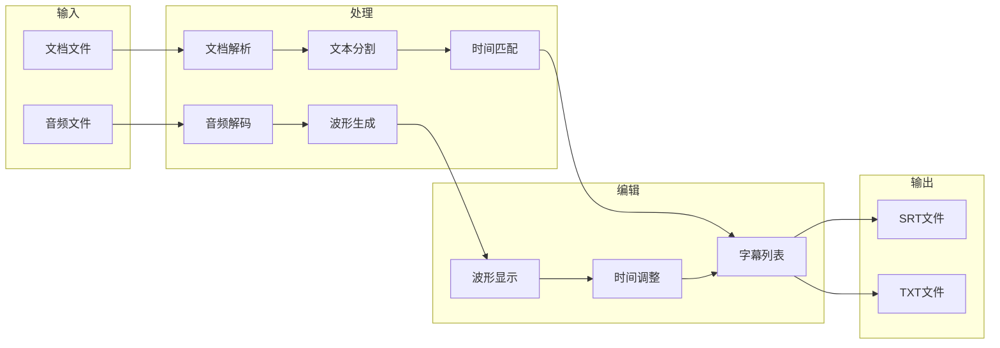

# 音频字幕生成器 - 技术设计文档

Feature Name: audio-subtitle-generator
Updated: 2026-03-10

## Description

音频字幕生成器是一个纯前端 Web 应用，基于 Vue 3 + Element Plus 构建。用户上传音频文件和文档后，应用通过时间轴智能匹配算法自动生成字幕，提供可视化波形编辑器进行精确调整，支持导出 SRT 和 TXT 格式字幕文件。

## Architecture

### 系统架构图



### 数据流程图



## Components and Interfaces

### 目录结构

```
audio-subtitle-app/
├── index.html                    # HTML 入口
├── package.json                  # 项目配置
├── vite.config.js               # Vite 配置
├── src/
│   ├── main.js                  # 应用入口
│   ├── App.vue                  # 根组件
│   ├── views/
│   │   └── HomeView.vue         # 主页视图
│   ├── components/
│   │   ├── FileUploader.vue     # 文件上传组件
│   │   ├── WaveformEditor.vue   # 波形编辑器
│   │   ├── SubtitleItem.vue     # 字幕条目组件
│   │   ├── SubtitleList.vue     # 字幕列表组件
│   │   ├── PlaybackControls.vue # 播放控制组件
│   │   └── ExportPanel.vue      # 导出面板
│   ├── composables/
│   │   ├── useAudioProcessor.js # 音频处理 Hook
│   │   ├── useDocumentParser.js # 文档解析 Hook
│   │   ├── useSubtitleGenerator.js # 字幕生成 Hook
│   │   ├── usePlayback.js       # 播放控制 Hook
│   │   └── useWaveform.js       # 波形渲染 Hook
│   ├── stores/
│   │   ├── audioStore.js        # 音频状态
│   │   └── subtitleStore.js     # 字幕状态
│   ├── utils/
│   │   ├── srtFormatter.js      # SRT 格式化
│   │   ├── txtFormatter.js      # TXT 格式化
│   │   ├── timeUtils.js         # 时间工具
│   │   └── textSplitter.js      # 文本分割器
│   └── styles/
│       ├── variables.css        # CSS 变量
│       └── main.css             # 主样式文件
└── public/
    └── favicon.ico
```

### 核心组件接口

#### FileUploader.vue

```typescript
interface FileUploaderProps {
  acceptTypes: string[]       // 接受的文件类型
  maxSize: number            // 最大文件大小 (bytes)
  multiple: boolean          // 是否支持多文件
}

interface FileUploaderEmits {
  'upload-success': (file: UploadedFile) => void
  'upload-error': (error: UploadError) => void
}

interface UploadedFile {
  id: string
  name: string
  size: number
  type: string
  file: File
}
```

#### WaveformEditor.vue

```typescript
interface WaveformEditorProps {
  audioBuffer: AudioBuffer    // 音频数据
  subtitles: Subtitle[]       // 字幕数据
  currentTime: number         // 当前播放时间
}

interface WaveformEditorEmits {
  'time-select': (time: number) => void
  'region-select': (region: TimeRegion) => void
  'subtitle-add': (region: TimeRegion) => void
  'subtitle-select': (id: string) => void
}

interface TimeRegion {
  start: number              // 开始时间 (秒)
  end: number                // 结束时间 (秒)
}
```

#### SubtitleList.vue

```typescript
interface SubtitleListProps {
  subtitles: Subtitle[]
  currentTime: number
  activeId: string | null
}

interface SubtitleListEmits {
  'update': (id: string, data: Partial<Subtitle>) => void
  'delete': (id: string) => void
  'select': (id: string) => void
}

interface Subtitle {
  id: string
  index: number
  startTime: number          // 开始时间 (秒)
  endTime: number            // 结束时间 (秒)
  text: string               // 字幕文本
}
```

### Composables 接口

#### useAudioProcessor

```typescript
interface AudioProcessor {
  // 状态
  audioBuffer: Ref<AudioBuffer | null>
  duration: Ref<number>
  isLoading: Ref<boolean>
  error: Ref<string | null>

  // 方法
  loadAudio(file: File): Promise<void>
  getWaveformData(width: number): Float32Array
  play(): void
  pause(): void
  seek(time: number): void
  dispose(): void
}
```

#### useDocumentParser

```typescript
interface DocumentParser {
  // 状态
  content: Ref<string>
  isLoading: Ref<boolean>
  error: Ref<string | null>

  // 方法
  parseFile(file: File): Promise<string>
}

// 支持格式
type SupportedFormat = 'txt' | 'doc' | 'docx'
```

#### useSubtitleGenerator

```typescript
interface SubtitleGenerator {
  // 状态
  subtitles: Ref<Subtitle[]>
  isGenerating: Ref<boolean>

  // 方法
  generate(content: string, duration: number): Subtitle[]
  addSubtitle(start: number, end: number, text: string): void
  updateSubtitle(id: string, data: Partial<Subtitle>): void
  deleteSubtitle(id: string): void
  reorderSubtitles(): void
}
```

#### useWaveform

```typescript
interface WaveformRenderer {
  // 方法
  init(canvas: HTMLCanvasElement): void
  drawWaveform(data: Float32Array): void
  drawRegion(region: TimeRegion, color: string): void
  drawPlayhead(time: number): void
  clear(): void
  setZoom(level: number): void
  setScroll(position: number): void
}
```

## Data Models

### 字幕数据模型

```typescript
interface Subtitle {
  id: string                  // 唯一标识符 (UUID)
  index: number               // 序号 (导出时使用)
  startTime: number           // 开始时间 (秒，精确到毫秒)
  endTime: number             // 结束时间 (秒，精确到毫秒)
  text: string                // 字幕文本内容
}

interface SubtitleStore {
  subtitles: Subtitle[]
  activeId: string | null
  editingId: string | null
}
```

### 音频数据模型

```typescript
interface AudioStore {
  file: File | null
  audioBuffer: AudioBuffer | null
  duration: number
  currentTime: number
  isPlaying: boolean
  waveformData: Float32Array | null
}
```

### 文档数据模型

```typescript
interface DocumentStore {
  file: File | null
  content: string
  paragraphs: string[]        // 按段落分割的文本
}
```

## Correctness Properties

### 时间约束

1. **时间有效性**: 所有字幕的 `startTime` 和 `endTime` 必须满足 `0 <= startTime < endTime <= audioDuration`
2. **时间非重叠**: 相邻字幕的时间范围不应重叠（允许有间隙）
3. **时间排序**: 字幕列表必须按 `startTime` 升序排列

### 文本约束

1. **文本非空**: 每条字幕的 `text` 不能为空字符串
2. **文本长度**: 单条字幕文本建议不超过 84 个字符（标准字幕规范）
3. **字符编码**: 导出文件使用 UTF-8 编码

### 格式约束

1. **SRT 时间格式**: `HH:MM:SS,mmm`（逗号分隔毫秒）
2. **SRT 序号**: 从 1 开始连续编号

## Error Handling

### 错误类型定义

```typescript
enum AppErrorType {
  FILE_TYPE_INVALID = 'FILE_TYPE_INVALID',
  FILE_SIZE_EXCEEDED = 'FILE_SIZE_EXCEEDED',
  AUDIO_DECODE_FAILED = 'AUDIO_DECODE_FAILED',
  DOCUMENT_PARSE_FAILED = 'DOCUMENT_PARSE_FAILED',
  EXPORT_FAILED = 'EXPORT_FAILED',
}

interface AppError {
  type: AppErrorType
  message: string
  detail?: string
}
```

### 错误处理策略

| 错误类型 | 处理方式 | 用户提示 |
|---------|---------|---------|
| FILE_TYPE_INVALID | 阻止上传 | "不支持的文件格式，请上传 {支持格式列表}" |
| FILE_SIZE_EXCEEDED | 阻止上传 | "文件大小超过限制 ({最大值})" |
| AUDIO_DECODE_FAILED | 重试或提示 | "音频解码失败，请尝试其他文件" |
| DOCUMENT_PARSE_FAILED | 提示详情 | "文档解析失败: {错误详情}" |
| EXPORT_FAILED | 提供重试 | "导出失败，请重试" |

### 错误边界组件

```vue
<template>
  <el-alert
    v-if="error"
    :title="error.message"
    :description="error.detail"
    type="error"
    show-icon
    closable
    @close="clearError"
  />
</template>
```

## Test Strategy

### 单元测试

使用 Vitest 进行单元测试：

```javascript
describe('srtFormatter', () => {
  it('should format subtitle to SRT correctly', () => {
    const subtitle = {
      id: '1',
      index: 1,
      startTime: 1.5,
      endTime: 4.2,
      text: 'Hello World'
    }
    const result = formatToSRT(subtitle)
    expect(result).toBe(
      '1\n00:00:01,500 --> 00:00:04,200\nHello World\n'
    )
  })
})

describe('textSplitter', () => {
  it('should split text by sentences', () => {
    const text = 'First sentence. Second sentence. Third sentence.'
    const result = splitBySentences(text)
    expect(result).toHaveLength(3)
  })

  it('should respect max length constraint', () => {
    const text = 'A very long text...'
    const result = splitBySentences(text, { maxLength: 50 })
    result.forEach(item => {
      expect(item.length).toBeLessThanOrEqual(50)
    })
  })
})
```

### 组件测试

```javascript
describe('SubtitleList.vue', () => {
  it('should render subtitle items', () => {
    const subtitles = [
      { id: '1', index: 1, startTime: 0, endTime: 2, text: 'Test 1' },
      { id: '2', index: 2, startTime: 2, endTime: 4, text: 'Test 2' },
    ]
    const wrapper = mount(SubtitleList, {
      props: { subtitles, currentTime: 0, activeId: null }
    })
    expect(wrapper.findAll('.subtitle-item')).toHaveLength(2)
  })
})
```

### 集成测试场景

1. **完整流程测试**: 上传音频和文档 → 生成字幕 → 编辑 → 导出
2. **格式兼容性测试**: 测试所有支持的音频和文档格式
3. **边界条件测试**: 空文件、超大文件、特殊字符处理

## UI Design

### 界面布局

```
+----------------------------------------------------------+
|  Logo  音频字幕生成器                    [帮助] [关于]    |
+----------------------------------------------------------+
|                                                          |
|  +----------------------------------------------------+  |
|  |              文件上传区域                           |  |
|  |  [拖拽音频文件到此处]  [拖拽文档文件到此处]        |  |
|  +----------------------------------------------------+  |
|                                                          |
+----------------------------------------------------------+
|  [▶播放] [⏸暂停] [停止]  ▬▬▬▬▬○▬▬▬▬▬  00:00 / 05:30     |
+----------------------------------------------------------+
|                                                          |
|  +----------------------------------------------------+  |
|  |              波形编辑器                             |  |
|  |  ▁▂▃▄▅▆▇█▇▆▅▄▃▂▁▁▂▃▄▅▆▇█▇▆▅▄▃▂▁                 |  |
|  |  |字幕1|    |字幕2|      |字幕3|                  |  |
|  |  ▼      当前播放位置                                 |  |
|  +----------------------------------------------------+  |
|                                                          |
+----------------------------------------------------------+
|  字幕列表                              [+添加] [生成字幕] |
|  +----------------------------------------------------+  |
|  | #1  00:00:01.000 --> 00:00:03.500  [编辑] [删除]  |  |
|  |     第一条字幕内容...                              |  |
|  +----------------------------------------------------+  |
|  | #2  00:00:03.500 --> 00:00:06.000  [编辑] [删除]  |  |
|  |     第二条字幕内容...                              |  |
|  +----------------------------------------------------+  |
|                                                          |
+----------------------------------------------------------+
|                                    [导出 SRT] [导出 TXT] |
+----------------------------------------------------------+
```

### 配色方案

```css
:root {
  /* 主色调 */
  --primary-color: #409EFF;
  --primary-hover: #66B1FF;

  /* 背景色 */
  --bg-color: #F5F7FA;
  --card-bg: #FFFFFF;
  --waveform-bg: #1A1A2E;

  /* 文字颜色 */
  --text-primary: #303133;
  --text-secondary: #909399;

  /* 波形颜色 */
  --waveform-color: #4FC3F7;
  --region-color: rgba(64, 158, 255, 0.3);
  --playhead-color: #FF5252;

  /* 字幕标记颜色 */
  --subtitle-marker: #409EFF;
  --subtitle-active: #67C23A;

  /* 状态色 */
  --success-color: #67C23A;
  --warning-color: #E6A23C;
  --error-color: #F56C6C;
}
```

### 响应式断点

```css
/* 桌面端 (>= 1200px) */
@media (min-width: 1200px) {
  .layout { flex-direction: column; }
  .waveform-editor { height: 300px; }
}

/* 平板端 (768px - 1199px) */
@media (min-width: 768px) and (max-width: 1199px) {
  .layout { flex-direction: column; }
  .waveform-editor { height: 200px; }
}

/* 移动端 (< 768px) */
@media (max-width: 767px) {
  .layout { flex-direction: column; }
  .waveform-editor { height: 150px; }
}
```

## Technology Stack

### 前端框架

| 技术 | 版本 | 用途 |
|-----|------|-----|
| Vue 3 | 3.5.x | 前端框架 |
| Element Plus | 2.x | UI 组件库 |
| Pinia | 3.x | 状态管理 |
| Vue Router | 5.x | 路由管理 |

### 构建工具

| 技术 | 版本 | 用途 |
|-----|------|-----|
| Vite | 7.x | 构建工具 |
| Vitest | 4.x | 单元测试 |

### 核心依赖

| 库名 | 用途 |
|-----|-----|
| mammoth.js | DOCX 文件解析 |
| uuid | 唯一 ID 生成 |

### Web API 使用

| API | 用途 |
|-----|-----|
| Web Audio API | 音频解码、播放控制 |
| Canvas API | 波形渲染 |
| FileReader API | 文件读取 |
| Blob API | 文件下载 |

## Implementation Notes

### 字幕生成算法

时间轴智能匹配算法的核心逻辑：

```javascript
function generateSubtitles(text, duration) {
  // 1. 按句子分割文本
  const sentences = splitBySentences(text)

  // 2. 计算每句的字符占比
  const totalChars = sentences.reduce((sum, s) => sum + s.length, 0)

  // 3. 按字符占比分配时间
  let currentTime = 0
  return sentences.map(sentence => {
    const ratio = sentence.length / totalChars
    const segmentDuration = duration * ratio
    const subtitle = {
      startTime: currentTime,
      endTime: currentTime + segmentDuration,
      text: sentence.trim()
    }
    currentTime += segmentDuration
    return subtitle
  })
}
```

### 波形渲染优化

1. **采样降频**: 对长音频进行采样，降低渲染点数
2. **虚拟滚动**: 波形区域只渲染可见部分
3. **离屏渲染**: 使用 OffscreenCanvas 提高性能
4. **防抖处理**: 缩放和滚动操作添加防抖

### SRT 格式化

```javascript
function formatTime(seconds) {
  const h = Math.floor(seconds / 3600)
  const m = Math.floor((seconds % 3600) / 60)
  const s = Math.floor(seconds % 60)
  const ms = Math.floor((seconds % 1) * 1000)
  return `${pad(h, 2)}:${pad(m, 2)}:${pad(s, 2)},${pad(ms, 3)}`
}

function formatToSRT(subtitles) {
  return subtitles.map((sub, index) =>
    `${index + 1}\n${formatTime(sub.startTime)} --> ${formatTime(sub.endTime)}\n${sub.text}\n`
  ).join('\n')
}
```

## References

- [Web Audio API - MDN](https://developer.mozilla.org/en-US/docs/Web/API/Web_Audio_API)
- [SRT File Format Specification](https://en.wikipedia.org/wiki/SubRip#SubRip_file_format)
- [mammoth.js Documentation](https://github.com/mwilliamson/mammoth.js)
