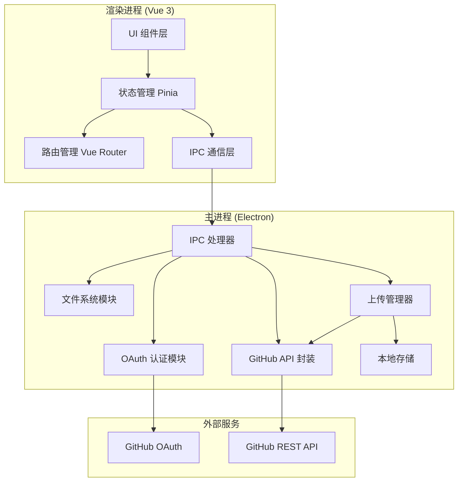

# GitHub 客户端管理工具

Feature Name: github-folder-uploader
Updated: 2026-03-07

## Description

GitHub 客户端管理工具是一个功能完整的桌面应用程序,基于 Electron 和 Vue 3 技术栈构建,为用户提供完整的 GitHub 仓库和文件管理功能。用户可以通过简化的 OAuth 授权快速登录,查看和管理 GitHub 仓库,浏览、上传、编辑和删除文件。

## Architecture

### 系统架构图



### 核心模块说明

**渲染进程 (Vue 3)**:
- **UI 组件层**: 负责用户界面的渲染和交互
- **状态管理 (Pinia)**: 管理应用全局状态,包括认证状态、仓库数据、文件数据等
- **路由管理 (Vue Router)**: 管理页面导航和路由
- **IPC 通信层**: 通过 IPC 与主进程通信

**主进程 (Electron)**:
- **IPC 处理器**: 处理渲染进程的通信请求
- **OAuth 认证模块**: 实现 GitHub OAuth 授权流程
- **GitHub API 封装**: 封装 GitHub REST API v3 调用
- **文件系统模块**: 读取本地文件夹结构
- **上传管理器**: 管理上传任务队列、并发控制、断点续传
- **本地存储**: 存储应用配置和上传状态

## Components and Interfaces

### 1. OAuth 认证模块

**文件路径**: `electron/auth/github-oauth.js`

**职责**:
- 启动本地 HTTP 服务器监听 OAuth 回调
- 打开浏览器进行 GitHub 授权
- 获取并存储 Access Token
- 验证 Token 有效性

**接口定义**:

```javascript
class GitHubOAuth {
  constructor(clientId, clientSecret)

  // 启动授权流程
  async authenticate(): Promise<AuthResult>

  // 获取存储的 Token
  async getStoredToken(): Promise<string | null>

  // 验证 Token 有效性
  async validateToken(token: string): Promise<boolean>

  // 注销登录
  async logout(): Promise<void>

  // 设置 OAuth 配置
  async setOAuthConfig(clientId: string, clientSecret: string): void
}

interface AuthResult {
  success: boolean
  accessToken?: string
  error?: string
}
```

### 2. GitHub API 封装

**文件路径**: `electron/api/github-api.js`

**职责**:
- 封装 GitHub REST API v3
- 用户信息获取
- 仓库管理(增删改查)
- 文件操作(上传、删除、编辑)
- 错误处理和重试

**接口定义**:

```javascript
class GitHubAPI {
  constructor(accessToken: string)

  // ========== 用户相关 ==========
  // 获取当前用户信息
  async getCurrentUser(): Promise<GitHubUser>

  // ========== 仓库管理 ==========
  // 获取用户仓库列表
  async getRepositories(params: RepositoryQueryParams): Promise<Repository[]>

  // 获取单个仓库信息
  async getRepository(owner: string, repo: string): Promise<Repository>

  // 创建新仓库
  async createRepository(params: CreateRepositoryParams): Promise<Repository>

  // 更新仓库设置
  async updateRepository(owner: string, repo: string, params: UpdateRepositoryParams): Promise<Repository>

  // 删除仓库
  async deleteRepository(owner: string, repo: string): Promise<void>

  // ========== 文件操作 ==========
  // 获取仓库内容
  async getRepositoryContent(params: ContentParams): Promise<RepositoryContent[]>

  // 获取文件内容
  async getFileContent(params: FileContentParams): Promise<string>

  // 上传文件
  async uploadFile(params: UploadFileParams): Promise<UploadResult>

  // 批量上传文件
  async uploadFiles(files: UploadFileParams[]): Promise<UploadResult[]>

  // 删除文件
  async deleteFile(params: DeleteFileParams): Promise<void>

  // 更新文件
  async updateFile(params: UpdateFileParams): Promise<void>
}

// 数据结构定义
interface GitHubUser {
  login: string
  id: number
  avatar_url: string
  html_url: string
  name: string
  email: string
}

interface Repository {
  id: number
  name: string
  full_name: string
  description: string
  private: boolean
  html_url: string
  language: string
  stargazers_count: number
  forks_count: number
  updated_at: string
  created_at: string
}

interface RepositoryQueryParams {
  type?: 'all' | 'owner' | 'public' | 'private' | 'member'
  sort?: 'created' | 'updated' | 'pushed' | 'full_name'
  direction?: 'asc' | 'desc'
  per_page?: number
  page?: number
}

interface CreateRepositoryParams {
  name: string
  description?: string
  private?: boolean
  auto_init?: boolean
  gitignore_template?: string
  license_template?: string
}

interface UpdateRepositoryParams {
  name?: string
  description?: string
  private?: boolean
  homepage?: string
  topics?: string[]
}

interface RepositoryContent {
  name: string
  path: string
  type: 'file' | 'dir' | 'symlink' | 'submodule'
  size: number
  sha: string
  html_url: string
  download_url: string
}

interface UploadFileParams {
  owner: string
  repo: string
  path: string
  content: Buffer | string
  message: string
  branch?: string
  sha?: string
}

interface UploadResult {
  success: boolean
  path: string
  sha?: string
  error?: string
}
```

### 3. 文件系统模块

**文件路径**: `electron/fs/folder-reader.js`

**职责**:
- 打开文件夹选择对话框
- 递归读取文件夹结构
- 生成文件树数据
- 计算文件大小

**接口定义**:

```javascript
class FolderReader {
  // 打开文件夹选择对话框
  async selectFolder(): Promise<string | null>

  // 读取文件夹结构
  async readFolderStructure(folderPath: string): Promise<FileTree>

  // 计算文件夹大小
  calculateFolderSize(fileTree: FileTree): FolderSizeInfo
}

interface FileTree {
  name: string
  path: string
  type: 'file' | 'folder'
  size?: number
  children?: FileTree[]
}

interface FolderSizeInfo {
  totalFiles: number
  totalFolders: number
  totalSize: number
}
```

### 4. 上传管理器

**文件路径**: `electron/upload/upload-manager.js`

**职责**:
- 管理上传任务队列
- 实现智能并发控制
- 断点续传功能
- 进度跟踪
- 错误重试

**接口定义**:

```javascript
class UploadManager {
  constructor(githubAPI: GitHubAPI, storage: LocalStorage)

  // 创建上传任务
  async createUploadTask(params: CreateTaskParams): Promise<UploadTask>

  // 启动上传任务
  async startTask(taskId: string): Promise<void>

  // 暂停任务
  async pauseTask(taskId: string): Promise<void>

  // 恢复任务
  async resumeTask(taskId: string): Promise<void>

  // 取消任务
  async cancelTask(taskId: string): Promise<void>

  // 重试失败文件
  async retryFailedFiles(taskId: string): Promise<void>

  // 获取任务进度
  getTaskProgress(taskId: string): TaskProgress

  // 自动调整并发数
  adjustConcurrency(responseTime: number, errorRate: number): void

  // 恢复未完成任务
  async recoverUnfinishedTasks(): Promise<UploadTask[]>
}

interface UploadTask {
  id: string
  folderPath: string
  repository: string
  branch: string
  targetPath: string
  status: 'pending' | 'running' | 'paused' | 'completed' | 'cancelled'
  files: FileUploadStatus[]
  createdAt: Date
  updatedAt: Date
}

interface FileUploadStatus {
  path: string
  localPath: string
  status: 'pending' | 'uploading' | 'completed' | 'failed'
  error?: string
  retryCount: number
}

interface TaskProgress {
  totalFiles: number
  completedFiles: number
  failedFiles: number
  currentFile: string
  uploadSpeed: number
  estimatedTime: number
}
```

### 5. 本地存储

**文件路径**: `electron/storage/local-storage.js`

**职责**:
- 使用 Electron `safeStorage` 加密存储敏感信息
- 存储应用配置
- 存储上传任务状态

**接口定义**:

```javascript
class LocalStorage {
  // 存储加密数据
  async setSecure(key: string, value: string): Promise<void>

  // 读取加密数据
  async getSecure(key: string): Promise<string | null>

  // 存储普通配置
  async setConfig(key: string, value: any): Promise<void>

  // 读取普通配置
  async getConfig(key: string): Promise<any>

  // 删除数据
  async delete(key: string): Promise<void>

  // 清空所有数据
  async clear(): Promise<void>
}
```

### 6. Vue 组件结构

**主要页面和组件**:

```
src/
├── views/                      # 页面视图
│   ├── Login.vue              # 登录页面
│   ├── Dashboard.vue          # 仪表盘(仓库列表)
│   ├── RepositoryDetail.vue   # 仓库详情页面
│   ├── RepositorySettings.vue # 仓库设置页面
│   ├── FileBrowser.vue        # 文件浏览器
│   ├── FileEditor.vue         # 文件编辑器
│   ├── UploadManager.vue      # 上传管理页面
│   └── Settings.vue           # 应用设置页面
├── components/                 # Vue 组件
│   ├── Auth/
│   │   ├── LoginButton.vue    # 登录按钮
│   │   └── UserProfile.vue    # 用户信息显示
│   ├── Repository/
│   │   ├── RepoCard.vue       # 仓库卡片
│   │   ├── RepoList.vue       # 仓库列表
│   │   ├── RepoCreator.vue    # 创建仓库
│   │   └── RepoDeleter.vue    # 删除仓库确认
│   ├── File/
│   │   ├── FileList.vue       # 文件列表
│   │   ├── FileTree.vue       # 文件树
│   │   ├── FilePreview.vue    # 文件预览
│   │   └── Breadcrumb.vue     # 面包屑导航
│   ├── Upload/
│   │   ├── FolderUploader.vue # 文件夹上传
│   │   ├── ProgressBar.vue    # 进度条
│   │   └── FileQueue.vue      # 文件队列
│   └── Common/
│       ├── Sidebar.vue        # 侧边栏
│       ├── Header.vue         # 顶部栏
│       ├── Loading.vue        # 加载动画
│       ├── ErrorDialog.vue    # 错误对话框
│       └── ConfirmDialog.vue  # 确认对话框
└── stores/                     # Pinia 状态管理
    ├── auth.js                # 认证状态
    ├── repository.js          # 仓库状态
    ├── file.js                # 文件状态
    ├── upload.js              # 上传状态
    └── settings.js            # 设置状态
```

## Data Models

### 应用状态模型

```typescript
// 认证状态
interface AuthState {
  isAuthenticated: boolean
  user: GitHubUser | null
  accessToken: string | null
  oauthConfig: {
    clientId: string | null
    clientSecret: string | null
  }
}

// 仓库状态
interface RepositoryState {
  repositories: Repository[]
  currentRepository: Repository | null
  loading: boolean
  filters: {
    type: 'all' | 'owner' | 'public' | 'private' | 'member'
    search: string
    sort: 'created' | 'updated' | 'pushed' | 'full_name'
  }
  pagination: {
    page: number
    perPage: number
    total: number
  }
}

// 文件状态
interface FileState {
  currentPath: string
  files: RepositoryContent[]
  fileTree: FileTree | null
  selectedFiles: string[]
  loading: boolean
}

// 上传状态
interface UploadState {
  currentTask: UploadTask | null
  tasks: UploadTask[]
  progress: TaskProgress | null
}

// 设置状态
interface SettingsState {
  theme: 'light' | 'dark'
  defaultBranch: string
  maxConcurrency: number
  autoAdjustConcurrency: boolean
}
```

## Correctness Properties

### 1. OAuth 认证安全性

- **属性**: Access Token 必须使用 Electron 的 `safeStorage` API 加密存储
- **验证**: 存储的 Token 在应用重启后能够正确解密使用
- **不变量**: Token 永远不会以明文形式存储在文件系统中

### 2. 仓库操作一致性

- **属性**: 仓库的增删改操作必须与 GitHub 服务器状态保持一致
- **验证**: 操作成功后刷新仓库列表,验证操作结果
- **不变量**: 本地显示的仓库列表始终反映真实的 GitHub 状态

### 3. 文件上传可靠性

- **属性**: 文件上传成功后必须确保文件确实存在于仓库中
- **验证**: 上传成功后通过 API 验证文件存在
- **不变量**: 上传状态始终反映真实的上传进度

### 4. 断点续传完整性

- **属性**: 应用崩溃后必须能够恢复未完成任务的状态
- **验证**: 模拟应用崩溃场景,重启后检查任务恢复情况
- **不变量**: 本地存储中的文件状态与实际上传进度保持同步

## Error Handling

### 错误分类与处理策略

#### 1. OAuth 认证错误

| 错误类型 | 处理策略 |
|---------|---------|
| 网络错误 | 显示网络错误提示,提供重试按钮 |
| 用户取消授权 | 显示授权取消提示,引导用户重新授权 |
| Token 过期 | 自动清除本地 Token,重新发起授权 |
| 配置错误 | 显示详细的配置错误信息,引导用户检查 Client ID/Secret |

#### 2. GitHub API 错误

| 错误类型 | HTTP 状态码 | 处理策略 |
|---------|------------|---------|
| 认证失败 | 401 | 清除 Token,重新授权 |
| 权限不足 | 403 | 显示权限不足错误,检查 Token 权限范围 |
| 资源未找到 | 404 | 显示资源不存在错误,引导用户检查 |
| 冲突 | 409 | 文件/仓库已存在,提示用户处理 |
| 速率限制 | 403 + rate limit | 显示剩余时间,自动等待并重试 |
| 服务器错误 | 5xx | 自动重试(最多 3 次),失败后显示错误 |

#### 3. 文件操作错误

| 错误类型 | 处理策略 |
|---------|---------|
| 文件不存在 | 显示错误,刷新文件列表 |
| 权限不足 | 显示权限错误 |
| 文件过大 | 显示文件大小限制错误 |
| 网络中断 | 暂停上传,保存进度 |

## Test Strategy

### 1. 单元测试

**测试框架**: Vitest

**覆盖范围**:
- GitHub API 封装类的各个方法
- 文件系统模块的文件读取逻辑
- 上传管理器的任务调度和并发控制
- 本地存储的读写操作

### 2. 集成测试

**测试框架**: Playwright for Electron

**覆盖范围**:
- OAuth 授权完整流程
- 仓库创建、编辑、删除流程
- 文件上传、编辑、删除流程
- 断点续传功能

### 3. 性能测试

**测试指标**:
- 大量文件上传性能(500+ 文件)
- 仓库列表加载性能
- 内存使用情况

### 4. 跨平台测试

**测试环境**:
- Windows 10/11
- macOS 11+
- Ubuntu 20.04+

## References

[^1]: (Website) - GitHub REST API Documentation - https://docs.github.com/en/rest
[^2]: (Website) - Electron Security Best Practices - https://www.electronjs.org/docs/latest/tutorial/security
[^3]: (Website) - Vue 3 Documentation - https://vuejs.org/
[^4]: (Website) - Pinia State Management - https://pinia.vuejs.org/
[^5]: (Website) - Vue Router - https://router.vuejs.org/
