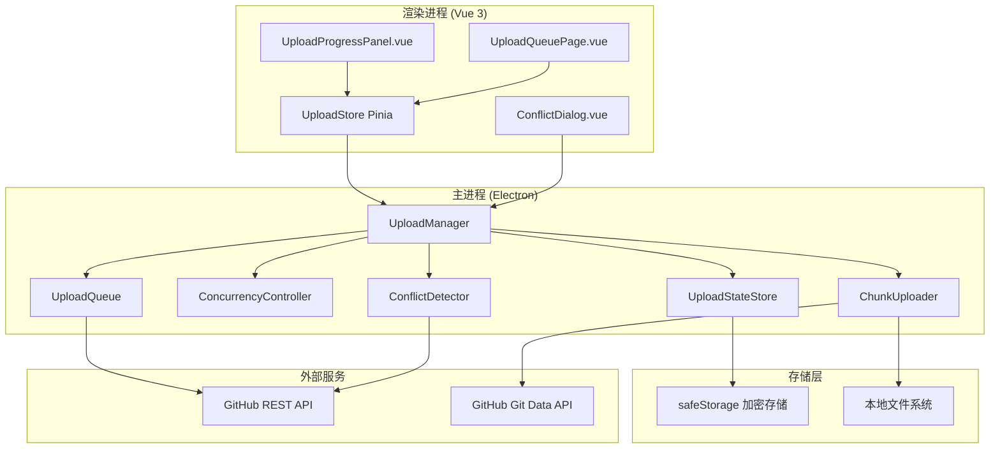
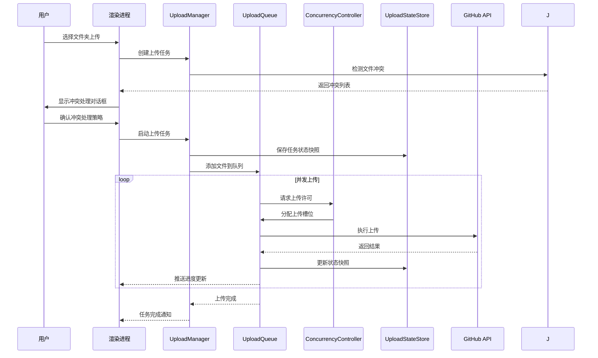

# 文件夹上传功能完善 - 技术设计文档

Feature Name: folder-upload-enhancement
Updated: 2026-03-08

## Description

本设计文档针对 GitHub 客户端桌面应用的「文件夹上传功能完善」模块，在现有基础上增强上传进度可视化、断点续传支持、并发上传控制、上传队列管理等功能，实现大文件智能上传策略。

## Architecture

### 模块架构图



### 数据流图



## Components and Interfaces

### 1. UploadManager (上传管理器)

**文件路径**: `electron/upload/upload-manager.js`

**职责**:
- 统筹管理所有上传任务
- 协调队列、并发控制器、状态存储
- 处理暂停、恢复、取消操作
- 提供进度回调机制

**接口定义**:

```javascript
class UploadManager {
  constructor(options = {}) {
    this.queue = new UploadQueue()
    this.concurrencyController = new ConcurrencyController(options.maxConcurrency || 3)
    this.stateStore = new UploadStateStore()
    this.chunkUploader = null // 初始化时注入
  }

  /**
   * 创建上传任务
   * @param {CreateTaskParams} params
   * @returns {Promise<UploadTask>}
   */
  async createTask(params) {}

  /**
   * 启动任务
   * @param {string} taskId
   */
  async startTask(taskId) {}

  /**
   * 暂停任务
   * @param {string} taskId
   */
  async pauseTask(taskId) {}

  /**
   * 恢复任务
   * @param {string} taskId
   */
  async resumeTask(taskId) {}

  /**
   * 取消任务
   * @param {string} taskId
   */
  async cancelTask(taskId) {}

  /**
   * 重试失败文件
   * @param {string} taskId
   * @param {string[]} filePaths 可选，指定文件
   */
  async retryFailed(taskId, filePaths) {}

  /**
   * 获取任务进度
   * @param {string} taskId
   * @returns {TaskProgress}
   */
  getProgress(taskId) {}

  /**
   * 恢复未完成任务（应用启动时调用）
   * @returns {Promise<UploadTask[]>}
   */
  async recoverUnfinishedTasks() {}

  /**
   * 设置进度回调
   * @param {function} callback
   */
  onProgress(callback) {}
}

interface CreateTaskParams {
  folderPath: string        // 本地文件夹路径
  owner: string             // 仓库所有者
  repo: string              // 仓库名称
  branch: string            // 目标分支
  targetPath: string        // 目标路径
  conflictStrategy: 'overwrite' | 'skip' | 'rename'
}

interface UploadTask {
  id: string
  status: 'pending' | 'running' | 'paused' | 'completed' | 'cancelled' | 'error'
  folderPath: string
  owner: string
  repo: string
  branch: string
  targetPath: string
  files: FileUploadStatus[]
  createdAt: string
  updatedAt: string
  stats: TaskStats
}

interface FileUploadStatus {
  path: string              // 相对路径
  localPath: string         // 本地绝对路径
  status: 'pending' | 'uploading' | 'completed' | 'failed' | 'skipped'
  size: number
  sha?: string              // 上传成功后的 SHA
  error?: string
  retryCount: number
  uploadedAt?: string
}

interface TaskStats {
  totalFiles: number
  totalSize: number
  completedFiles: number
  completedSize: number
  failedFiles: number
  skippedFiles: number
  uploadSpeed: number       // bytes/s
  estimatedTime: number     // 秒
}

interface TaskProgress {
  taskId: string
  status: string
  stats: TaskStats
  currentFiles: string[]    // 正在上传的文件
  recentSpeed: number[]     // 最近速度记录
}
```

### 2. UploadQueue (上传队列)

**文件路径**: `electron/upload/upload-queue.js`

**职责**:
- 维护待上传文件队列
- 支持优先级排序
- 提供队列操作（入队、出队、重排）

**接口定义**:

```javascript
class UploadQueue {
  constructor() {
    this.items = []
    this.currentIndex = 0
  }

  /**
   * 添加文件到队列
   * @param {FileQueueItem[]} items
   * @param {number} priority 优先级，数字越大越优先
   */
  enqueue(items, priority = 0) {}

  /**
   * 获取下一个待上传文件
   * @returns {FileQueueItem | null}
   */
  dequeue() {}

  /**
   * 标记文件完成
   * @param {string} filePath
   */
  markCompleted(filePath) {}

  /**
   * 标记文件失败
   * @param {string} filePath
   * @param {string} error
   */
  markFailed(filePath, error) {}

  /**
   * 重新入队失败文件
   * @param {string[]} filePaths
   */
  requeueFailed(filePaths) {}

  /**
   * 获取队列状态
   * @returns {QueueStatus}
   */
  getStatus() {}

  /**
   * 清空队列
   */
  clear() {}
}

interface FileQueueItem {
  path: string
  localPath: string
  size: number
  priority: number
  retryCount: number
}

interface QueueStatus {
  total: number
  pending: number
  uploading: number
  completed: number
  failed: number
}
```

### 3. ConcurrencyController (并发控制器)

**文件路径**: `electron/upload/concurrency-controller.js`

**职责**:
- 控制并发上传数量
- 实现自适应并发调整
- 管理上传槽位

**接口定义**:

```javascript
class ConcurrencyController {
  constructor(maxConcurrency = 3) {
    this.maxConcurrency = maxConcurrency
    this.currentConcurrency = 0
    this.activeSlots = new Map()
    this.responseTimes = []
    this.errorCount = 0
    this.autoAdjustEnabled = true
  }

  /**
   * 获取上传槽位
   * @returns {Promise<number>} 槽位ID
   */
  async acquireSlot() {}

  /**
   * 释放上传槽位
   * @param {number} slotId
   * @param {boolean} success
   * @param {number} responseTime 响应时间(ms)
   */
  releaseSlot(slotId, success, responseTime) {}

  /**
   * 设置最大并发数
   * @param {number} value
   */
  setMaxConcurrency(value) {}

  /**
   * 启用/禁用自适应调整
   * @param {boolean} enabled
   */
  setAutoAdjust(enabled) {}

  /**
   * 根据网络状况自动调整并发数
   */
  adjustByNetworkCondition() {}

  /**
   * 获取当前状态
   * @returns {ConcurrencyStatus}
   */
  getStatus() {}
}

interface ConcurrencyStatus {
  maxConcurrency: number
  currentConcurrency: number
  availableSlots: number
  avgResponseTime: number
  errorRate: number
  autoAdjustEnabled: boolean
}
```

### 4. UploadStateStore (上传状态存储)

**文件路径**: `electron/upload/upload-state-store.js`

**职责**:
- 使用 safeStorage 加密存储上传状态
- 实现状态快照的保存和恢复
- 管理历史记录

**接口定义**:

```javascript
class UploadStateStore {
  constructor(storage) {
    this.storage = storage  // LocalStorage 实例
    this.snapshotInterval = 5000  // 快照间隔 5 秒
    this.lastSnapshotTime = 0
  }

  /**
   * 保存任务状态快照
   * @param {UploadTask} task
   */
  async saveSnapshot(task) {}

  /**
   * 加载任务状态快照
   * @param {string} taskId
   * @returns {Promise<UploadTask | null>}
   */
  async loadSnapshot(taskId) {}

  /**
   * 删除任务快照
   * @param {string} taskId
   */
  async deleteSnapshot(taskId) {}

  /**
   * 获取所有未完成任务
   * @returns {Promise<UploadTask[]>}
   */
  async getUnfinishedTasks() {}

  /**
   * 添加到历史记录
   * @param {UploadTask} task
   */
  async addToHistory(task) {}

  /**
   * 获取历史记录
   * @param {HistoryQueryParams} params
   * @returns {Promise<UploadTask[]>}
   */
  async getHistory(params) {}

  /**
   * 清理过期历史记录
   */
  async cleanupHistory() {}
}

interface HistoryQueryParams {
  limit?: number
  offset?: number
  owner?: string
  repo?: string
  status?: string
  startDate?: string
  endDate?: string
}
```

### 5. ConflictDetector (冲突检测器)

**文件路径**: `electron/upload/conflict-detector.js`

**职责**:
- 检测本地文件与远程仓库的冲突
- 比较文件 SHA 判断是否相同
- 提供冲突解决建议

**接口定义**:

```javascript
class ConflictDetector {
  constructor(githubAPI) {
    this.githubAPI = githubAPI
  }

  /**
   * 检测冲突
   * @param {ConflictCheckParams} params
   * @returns {Promise<ConflictResult>}
   */
  async detect(params) {}

  /**
   * 计算本地文件 SHA
   * @param {string} filePath
   * @returns {Promise<string>}
   */
  async calculateLocalSHA(filePath) {}

  /**
   * 获取远程文件 SHA
   * @param {string} owner
   * @param {string} repo
   * @param {string} path
   * @param {string} branch
   * @returns {Promise<string | null>}
   */
  async getRemoteSHA(owner, repo, path, branch) {}
}

interface ConflictCheckParams {
  owner: string
  repo: string
  branch: string
  files: { path: string, localPath: string }[]
  targetPath: string
}

interface ConflictResult {
  conflicts: ConflictItem[]
  newFiles: string[]
  identicalFiles: string[]  // SHA 相同，可跳过
}

interface ConflictItem {
  path: string
  localSHA: string
  remoteSHA: string
  localSize: number
  remoteSize: number
}
```

### 6. LargeFileHandler (大文件处理器)

**文件路径**: `electron/upload/large-file-handler.js`

**职责**:
- 判断文件大小并选择上传策略
- 处理 Git LFS 提示
- 执行分块上传

**接口定义**:

```javascript
class LargeFileHandler {
  constructor(options = {}) {
    this.threshold = options.threshold || 50 * 1024 * 1024  // 50MB
    this.chunkUploader = null  // 初始化时注入
  }

  /**
   * 检查文件是否需要特殊处理
   * @param {number} fileSize
   * @returns {FileHandlingStrategy}
   */
  checkStrategy(fileSize) {}

  /**
   * 执行上传（自动选择策略）
   * @param {FileUploadParams} params
   * @param {function} onProgress
   * @returns {Promise<UploadResult>}
   */
  async upload(params, onProgress) {}

  /**
   * 设置大文件阈值
   * @param {number} threshold 字节
   */
  setThreshold(threshold) {}
}

interface FileHandlingStrategy {
  type: 'normal' | 'chunk' | 'lfs-recommended'
  threshold: number
  fileSize: number
}

interface FileUploadParams {
  owner: string
  repo: string
  branch: string
  path: string
  localPath: string
  message: string
}
```

### 7. Vue 组件

#### UploadProgressPanel.vue

**文件路径**: `src/components/Upload/UploadProgressPanel.vue`

**职责**:
- 浮动显示在右下角的上传进度面板
- 支持最小化/展开
- 显示总体进度和文件列表

**Props**:

```typescript
interface Props {
  minimized?: boolean  // 是否最小化
  position?: 'bottom-right' | 'bottom-left'
}
```

**Events**:

```typescript
emit('pause', taskId: string)
emit('resume', taskId: string)
emit('cancel', taskId: string)
emit('retry', taskId: string)
emit('expand')
emit('minimize')
```

#### UploadQueuePage.vue

**文件路径**: `src/views/UploadQueuePage.vue`

**职责**:
- 上传队列管理页面
- 显示所有任务（进行中、等待、已完成）
- 支持任务排序和操作

#### ConflictDialog.vue

**文件路径**: `src/components/Upload/ConflictDialog.vue`

**职责**:
- 显示文件冲突列表
- 提供冲突处理选项
- 支持批量处理

**Props**:

```typescript
interface Props {
  conflicts: ConflictItem[]
  visible: boolean
}

interface ConflictItem {
  path: string
  localSize: number
  remoteSize: number
}
```

**Events**:

```typescript
emit('resolve', result: ConflictResolution)
emit('close')

interface ConflictResolution {
  strategy: 'overwrite' | 'skip' | 'rename'
  applyToAll: boolean
}
```

### 8. Pinia Store

#### uploadStore

**文件路径**: `src/stores/upload.js`

**状态定义**:

```typescript
interface UploadState {
  // 当前活跃任务
  currentTasks: UploadTask[]

  // 队列中的任务
  pendingTasks: UploadTask[]

  // 已完成的任务（当前会话）
  completedTasks: UploadTask[]

  // 进度信息
  progress: Map<string, TaskProgress>

  // 并发设置
  concurrency: number
  autoAdjustConcurrency: boolean

  // UI 状态
  panelMinimized: boolean
  panelVisible: boolean
}
```

**Actions**:

```typescript
// 任务管理
createTask(params: CreateTaskParams): Promise<UploadTask>
startTask(taskId: string): Promise<void>
pauseTask(taskId: string): Promise<void>
resumeTask(taskId: string): Promise<void>
cancelTask(taskId: string): Promise<void>
retryFailed(taskId: string, filePaths?: string[]): Promise<void>

// 进度更新
updateProgress(taskId: string, progress: TaskProgress): void

// 设置
setConcurrency(value: number): void
setAutoAdjustConcurrency(enabled: boolean): void

// UI 控制
showPanel(): void
hidePanel(): void
togglePanel(): void
minimizePanel(): void
expandPanel(): void
```

## Data Models

### 上传状态快照数据结构

```typescript
interface UploadSnapshot {
  version: string           // 快照版本，用于迁移
  taskId: string
  createdAt: string
  updatedAt: string

  // 任务信息
  task: {
    folderPath: string
    owner: string
    repo: string
    branch: string
    targetPath: string
  }

  // 文件状态
  files: {
    path: string
    localPath: string
    status: 'pending' | 'completed' | 'failed' | 'skipped'
    size: number
    sha?: string
    error?: string
    retryCount: number
  }[]

  // 统计信息
  stats: {
    totalFiles: number
    totalSize: number
    completedFiles: number
    completedSize: number
    failedFiles: number
  }

  // 冲突处理策略
  conflictStrategy: 'overwrite' | 'skip' | 'rename'
}
```

### IPC 通信协议

```typescript
// 渲染进程 -> 主进程
'upload:createTask'      // 创建上传任务
'upload:startTask'       // 启动任务
'upload:pauseTask'       // 暂停任务
'upload:resumeTask'      // 恢复任务
'upload:cancelTask'      // 取消任务
'upload:retryFailed'     // 重试失败文件
'upload:getProgress'     // 获取进度
'upload:getTasks'        // 获取任务列表
'upload:checkConflict'   // 检测冲突
'upload:setConcurrency'  // 设置并发数

// 主进程 -> 渲染进程
'upload:progress'        // 进度更新
'upload:taskComplete'    // 任务完成
'upload:taskError'       // 任务错误
'upload:conflictDetected'// 检测到冲突
```

## Correctness Properties

### 1. 断点续传一致性

- **不变量**: 状态快照中的文件状态必须与实际上传状态一致
- **验证**: 每次上传成功后立即更新快照，应用崩溃后恢复时验证 SHA
- **实现**: 使用事务性写入，先写入临时文件再重命名

### 2. 并发安全性

- **不变量**: 同一文件不会被并发上传多次
- **验证**: 使用文件路径作为唯一键，上传前检查状态
- **实现**: 使用 Map 存储正在上传的文件，上传开始时加锁

### 3. 状态持久化可靠性

- **不变量**: 状态快照必须能够正确恢复
- **验证**: 每次保存后验证读取是否成功
- **实现**: 使用 safeStorage 加密，添加版本号用于迁移

### 4. 大文件上传完整性

- **不变量**: 大文件分块上传后必须完整
- **验证**: 上传完成后通过 API 验证文件 SHA
- **实现**: 使用 GitHub Git Data API 的 Blob 机制

## Error Handling

### 错误分类与处理策略

| 错误类型 | 错误码 | 处理策略 |
|---------|-------|---------|
| 网络超时 | ETIMEDOUT | 自动重试 3 次，间隔递增 |
| 连接重置 | ECONNRESET | 自动重试，降低并发数 |
| 认证失败 | 401 | 停止任务，提示重新登录 |
| 权限不足 | 403 | 标记失败，提示权限问题 |
| 资源未找到 | 404 | 标记失败，可能仓库被删除 |
| 冲突 | 409 | 自动重新获取 SHA 后重试 |
| 文件过大 | 413 | 提示使用 Git LFS |
| 速率限制 | 403 + rate limit | 等待 reset 时间后重试 |
| 服务器错误 | 5xx | 自动重试 3 次 |

### 重试策略

```javascript
const retryStrategy = {
  maxRetries: 3,
  baseDelay: 1000,    // 基础延迟 1 秒
  maxDelay: 30000,    // 最大延迟 30 秒
  backoffFactor: 2,   // 退避因子

  calculateDelay(retryCount) {
    const delay = this.baseDelay * Math.pow(this.backoffFactor, retryCount - 1)
    return Math.min(delay, this.maxDelay)
  }
}
```

## Test Strategy

### 1. 单元测试

**测试框架**: Vitest

**覆盖范围**:

- `UploadQueue`: 入队、出队、优先级排序
- `ConcurrencyController`: 槽位分配、自适应调整
- `UploadStateStore`: 快照保存/恢复、加密/解密
- `ConflictDetector`: SHA 计算、冲突检测
- `LargeFileHandler`: 策略选择、阈值判断

### 2. 集成测试

**测试框架**: Playwright for Electron

**测试场景**:

1. **正常上传流程**: 选择文件夹 -> 检测冲突 -> 确认上传 -> 进度显示 -> 完成
2. **断点续传**: 上传中暂停 -> 关闭应用 -> 重启 -> 恢复上传
3. **并发控制**: 设置不同并发数 -> 验证同时上传数量
4. **冲突处理**: 上传已存在文件 -> 选择不同策略 -> 验证结果
5. **大文件处理**: 上传 50MB+ 文件 -> 验证 Git LFS 提示

### 3. 性能测试

**测试指标**:

- 500 个小文件上传耗时
- 100MB 文件上传耗时
- 内存占用（长时间运行）
- 并发数对上传速度的影响

### 4. 异常测试

**测试场景**:

- 网络断开重连
- Token 过期
- 磁盘空间不足
- 目标仓库被删除
- GitHub API 限流

## Implementation Plan

### Phase 1: 基础设施 (预计 2 天)

1. 实现 `UploadQueue` 类
2. 实现 `ConcurrencyController` 类
3. 实现 `UploadStateStore` 类
4. 添加 IPC 通信接口

### Phase 2: 核心功能 (预计 3 天)

1. 实现 `UploadManager` 类
2. 实现 `ConflictDetector` 类
3. 增强 `LargeFileHandler` 类
4. 集成断点续传逻辑

### Phase 3: UI 组件 (预计 2 天)

1. 实现 `UploadProgressPanel.vue`
2. 实现 `UploadQueuePage.vue`
3. 实现 `ConflictDialog.vue`
4. 实现 `uploadStore` Pinia store

### Phase 4: 测试与优化 (预计 2 天)

1. 编写单元测试
2. 编写集成测试
3. 性能测试与优化
4. Bug 修复

## References

[^1]: (Website) - GitHub REST API - Contents - https://docs.github.com/en/rest/repos/contents
[^2]: (Website) - GitHub Git Data API - https://docs.github.com/en/rest/git
[^3]: (Website) - Electron safeStorage - https://www.electronjs.org/docs/latest/api/safe-storage
[^4]: (File) - electron/upload/chunk-uploader.js - 现有分块上传实现
[^5]: (File) - electron/api/github-api.js - GitHub API 封装
