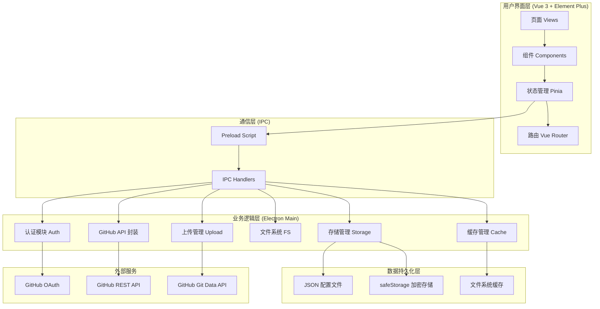
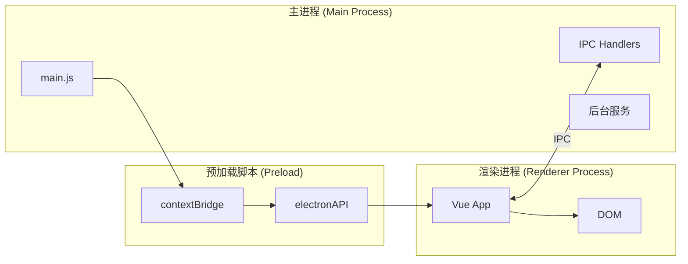

# GitHub 客户端桌面应用 - 技术架构文档

Feature Name: github-client-architecture
Updated: 2026-03-08

## 1. 项目概述

### 1.1 项目定位

GitHub 客户端管理工具是一款基于 Electron + Vue 3 的桌面应用程序，为用户提供完整的 GitHub 仓库和文件管理功能，包括 OAuth 授权登录、仓库管理、文件浏览与上传、搜索等功能。

### 1.2 核心价值

- **简化操作**：通过图形界面简化 GitHub 仓库和文件管理
- **高效上传**：支持文件夹批量上传、断点续传、并发控制
- **安全可靠**：Token 加密存储、状态持久化、错误恢复
- **跨平台**：支持 Windows、macOS、Linux

## 2. 技术栈

### 2.1 整体技术栈

| 层级 | 技术选型 | 版本 | 说明 |
|------|---------|------|------|
| 桌面框架 | Electron | 40.x | 跨平台桌面应用框架 |
| 前端框架 | Vue 3 | 3.5.x | 渐进式 JavaScript 框架 |
| UI 组件库 | Element Plus | 最新 | Vue 3 组件库 |
| 构建工具 | Vite | 7.x | 下一代前端构建工具 |
| 状态管理 | Pinia | 3.x | Vue 3 官方状态管理 |
| 路由管理 | Vue Router | 5.x | Vue.js 官方路由 |
| HTTP 客户端 | Axios | 1.x | 基于 Promise 的 HTTP 客户端 |
| 打包工具 | Electron Builder | 26.x | Electron 应用打包工具 |

### 2.2 开发语言

| 部分 | 语言 | 说明 |
|------|------|------|
| 渲染进程 (前端) | JavaScript (ES6+) | Vue 3 SFC 组件 |
| 主进程 (后端) | JavaScript (Node.js) | Electron 主进程逻辑 |
| 类型定义 | JSDoc / TypeScript (可选) | 接口和类型注释 |

### 2.3 开发工具

| 工具 | 用途 |
|------|------|
| npm | 包管理器 |
| ESLint | 代码检查 |
| Vitest | 单元测试 |
| Playwright | E2E 测试 |

## 3. 系统架构

### 3.1 整体架构图



### 3.2 进程架构



### 3.3 目录结构

```
github-client/
├── electron/                     # Electron 主进程
│   ├── main.js                   # 主进程入口
│   ├── preload.js                # 预加载脚本
│   ├── auth/                     # 认证模块
│   │   └── github-oauth.js       # GitHub OAuth 实现
│   ├── api/                      # API 封装
│   │   └── github-api.js         # GitHub REST API
│   ├── upload/                   # 上传模块
│   │   ├── chunk-uploader.js     # 分块上传
│   │   ├── upload-manager.js     # 上传管理器 (待实现)
│   │   ├── upload-queue.js       # 上传队列 (待实现)
│   │   ├── concurrency-controller.js # 并发控制 (待实现)
│   │   ├── upload-state-store.js # 状态存储 (待实现)
│   │   ├── conflict-detector.js  # 冲突检测 (待实现)
│   │   └── large-file-handler.js # 大文件处理 (待实现)
│   ├── fs/                       # 文件系统
│   │   └── folder-reader.js      # 文件夹读取
│   ├── storage/                  # 本地存储
│   │   └── local-storage.js      # 存储管理
│   └── cache/                    # 缓存管理
│       └── cache-manager.js      # 缓存管理器
├── src/                          # Vue 3 前端
│   ├── views/                    # 页面视图
│   │   ├── Login.vue             # 登录页
│   │   ├── Dashboard.vue         # 仪表盘
│   │   ├── RepositoryDetail.vue  # 仓库详情
│   │   ├── RepositorySettings.vue# 仓库设置
│   │   ├── FileBrowser.vue       # 文件浏览器
│   │   ├── FileEditor.vue        # 文件编辑器
│   │   ├── SearchPage.vue        # 搜索页面
│   │   ├── Settings.vue          # 应用设置
│   │   └── UploadQueuePage.vue   # 上传队列 (待实现)
│   ├── components/               # 组件
│   │   ├── Common/               # 通用组件
│   │   │   └── Sidebar.vue       # 侧边栏
│   │   ├── Auth/                 # 认证组件
│   │   ├── Repository/           # 仓库组件
│   │   ├── File/                 # 文件组件
│   │   └── Upload/               # 上传组件 (待实现)
│   │       ├── UploadProgressPanel.vue
│   │       ├── ConflictDialog.vue
│   │       └── FileQueue.vue
│   ├── stores/                   # Pinia 状态管理
│   │   ├── auth.js               # 认证状态
│   │   ├── repository.js         # 仓库状态
│   │   ├── settings.js           # 设置状态
│   │   ├── search.js             # 搜索状态
│   │   └── upload.js             # 上传状态 (待实现)
│   ├── router/                   # 路由配置
│   │   └── index.js
│   ├── utils/                    # 工具函数
│   │   ├── cache.js              # 缓存工具
│   │   └── upload.js             # 上传工具
│   ├── styles/                   # 样式文件
│   ├── App.vue                   # 根组件
│   └── main.js                   # 入口文件
├── .monkeycode/                  # 项目文档
│   └── specs/                    # 需求规格
├── index.html                    # HTML 模板
├── vite.config.js                # Vite 配置
├── package.json                  # 项目配置
└── README.md                     # 项目说明
```

## 4. 核心模块设计

### 4.1 认证模块 (Auth)

**职责**：实现 GitHub OAuth 2.0 授权流程

**实现方式**：
1. 启动本地 HTTP 服务器监听回调（端口 8888）
2. 打开系统浏览器进行 GitHub 授权
3. 捕获回调并获取 Access Token
4. 使用 Electron `safeStorage` 加密存储 Token

**核心接口**：

```javascript
class GitHubOAuth {
  constructor()
  setConfig(clientId, clientSecret)
  authenticate(): Promise<AuthResult>
  getStoredToken(): Promise<string | null>
  validateToken(token): Promise<boolean>
  logout(): Promise<void>
}
```

**安全策略**：
- Access Token 使用 `safeStorage` 加密存储
- 本地 HTTP 服务器仅监听 127.0.0.1
- 授权状态使用随机 state 参数防 CSRF

### 4.2 GitHub API 封装

**职责**：封装 GitHub REST API v3 调用

**API 分类**：

| 类别 | 方法 | 说明 |
|------|------|------|
| 用户 | getCurrentUser | 获取当前用户信息 |
| 仓库 | getRepositories | 获取仓库列表 |
| 仓库 | getRepository | 获取单个仓库 |
| 仓库 | createRepository | 创建仓库 |
| 仓库 | updateRepository | 更新仓库设置 |
| 仓库 | deleteRepository | 删除仓库 |
| 文件 | getRepositoryContent | 获取仓库内容 |
| 文件 | getFileContent | 获取文件内容 |
| 文件 | uploadFile | 上传文件 |
| 文件 | deleteFile | 删除文件 |
| 文件 | updateFile | 更新文件 |
| 搜索 | searchRepositories | 搜索仓库 |
| 搜索 | searchCode | 搜索代码 |
| Fork | forkRepository | Fork 仓库 |

**错误处理**：

```javascript
// HTTP 状态码处理
{
  401: '认证失败，请重新登录',
  403: '权限不足，请检查 Token 权限',
  404: '资源不存在',
  409: '资源冲突',
  422: '请求参数错误',
  429: '请求过于频繁，请稍后重试',
  500: '服务器错误',
  502: '网关错误',
  503: '服务不可用'
}
```

**速率限制处理**：
- 监控 `X-RateLimit-Remaining` 响应头
- 触发限制时自动等待 `X-RateLimit-Reset` 时间
- 显示剩余配额给用户

### 4.3 上传管理模块 (Upload)

**职责**：管理文件夹上传流程

**子模块设计**：

#### 4.3.1 UploadManager (上传管理器)

```javascript
class UploadManager {
  // 任务生命周期
  createTask(params): Promise<UploadTask>
  startTask(taskId): Promise<void>
  pauseTask(taskId): Promise<void>
  resumeTask(taskId): Promise<void>
  cancelTask(taskId): Promise<void>
  retryFailed(taskId, filePaths?): Promise<void>

  // 进度查询
  getProgress(taskId): TaskProgress

  // 断点续传
  recoverUnfinishedTasks(): Promise<UploadTask[]>
}
```

#### 4.3.2 UploadQueue (上传队列)

```javascript
class UploadQueue {
  enqueue(items, priority): void
  dequeue(): FileQueueItem | null
  markCompleted(filePath): void
  markFailed(filePath, error): void
  requeueFailed(filePaths): void
  getStatus(): QueueStatus
}
```

#### 4.3.3 ConcurrencyController (并发控制器)

```javascript
class ConcurrencyController {
  constructor(maxConcurrency = 3)
  acquireSlot(): Promise<number>
  releaseSlot(slotId, success, responseTime): void
  setMaxConcurrency(value): void
  setAutoAdjust(enabled): void
  adjustByNetworkCondition(): void
}
```

#### 4.3.4 UploadStateStore (状态存储)

```javascript
class UploadStateStore {
  // 状态快照（加密存储）
  saveSnapshot(task): Promise<void>
  loadSnapshot(taskId): Promise<UploadTask | null>
  deleteSnapshot(taskId): Promise<void>

  // 历史记录
  addToHistory(task): Promise<void>
  getHistory(params): Promise<UploadTask[]>
  cleanupHistory(): Promise<void>
}
```

#### 4.3.5 ConflictDetector (冲突检测)

```javascript
class ConflictDetector {
  detect(params): Promise<ConflictResult>
  calculateLocalSHA(filePath): Promise<string>
  getRemoteSHA(owner, repo, path, branch): Promise<string | null>
}
```

#### 4.3.6 LargeFileHandler (大文件处理)

```javascript
class LargeFileHandler {
  constructor(threshold = 50 * 1024 * 1024) // 50MB
  checkStrategy(fileSize): FileHandlingStrategy
  upload(params, onProgress): Promise<UploadResult>
  setThreshold(threshold): void
}
```

**上传策略**：

| 文件大小 | 上传方式 | 说明 |
|---------|---------|------|
| < 1MB | 普通 API 上传 | Contents API |
| 1MB - 50MB | 分块上传 | Git Data API |
| > 50MB | 提示 Git LFS | 用户确认后可分块上传 |

### 4.4 文件系统模块 (FS)

**职责**：处理本地文件系统操作

**功能**：
- 打开文件夹选择对话框
- 递归读取文件夹结构
- 读取文件内容
- 计算文件 SHA

```javascript
class FolderReader {
  selectFolder(): Promise<string | null>
  readFolderStructure(folderPath): Promise<FileTree>
  readFile(filePath): Promise<Buffer>
  calculateSHA(filePath): Promise<string>
}
```

### 4.5 存储模块 (Storage)

**职责**：管理本地数据持久化

**数据分类**：

| 数据类型 | 存储方式 | 说明 |
|---------|---------|------|
| Access Token | safeStorage 加密 | 敏感数据 |
| OAuth 配置 | JSON 文件 | Client ID/Secret |
| 上传状态快照 | safeStorage 加密 | 断点续传数据 |
| 应用设置 | JSON 文件 | 主题、并发数等 |
| 缓存数据 | JSON 文件 | API 响应缓存 |
| 历史记录 | JSON 文件 | 上传历史 |

**存储路径**：

```
{userData}/
├── config/
│   ├── oauth.json          # OAuth 配置
│   ├── settings.json       # 应用设置
│   └── upload-history.json # 上传历史
├── cache/
│   ├── api-cache.json      # API 响应缓存
│   └── repo-cache.json     # 仓库列表缓存
└── snapshots/
    └── {taskId}.enc        # 上传状态快照（加密）
```

## 5. 数据模型设计

### 5.1 用户相关

```typescript
interface GitHubUser {
  login: string           // 用户名
  id: number              // 用户 ID
  avatar_url: string      // 头像 URL
  html_url: string        // 主页 URL
  name: string            // 显示名称
  email: string           // 邮箱
  bio: string             // 简介
  public_repos: number    // 公开仓库数
  followers: number       // 关注者数
  following: number       // 关注数
}
```

### 5.2 仓库相关

```typescript
interface Repository {
  id: number
  name: string              // 仓库名
  full_name: string         // 完整名称 (owner/repo)
  description: string       // 描述
  private: boolean          // 是否私有
  html_url: string          // 页面 URL
  clone_url: string         // Clone URL
  language: string          // 主要语言
  stargazers_count: number  // 星标数
  forks_count: number       // Fork 数
  open_issues_count: number // Issue 数
  created_at: string        // 创建时间
  updated_at: string        // 更新时间
  pushed_at: string         // 推送时间
  default_branch: string    // 默认分支
}

interface RepositoryContent {
  name: string
  path: string
  type: 'file' | 'dir' | 'symlink' | 'submodule'
  size: number
  sha: string
  html_url: string
  download_url: string
}
```

### 5.3 上传相关

```typescript
interface UploadTask {
  id: string               // 任务 ID (UUID)
  status: 'pending' | 'running' | 'paused' | 'completed' | 'cancelled' | 'error'
  folderPath: string       // 本地文件夹路径
  owner: string            // 目标仓库所有者
  repo: string             // 目标仓库名
  branch: string           // 目标分支
  targetPath: string       // 目标路径
  files: FileUploadStatus[] // 文件状态列表
  conflictStrategy: 'overwrite' | 'skip' | 'rename'
  createdAt: string        // 创建时间
  updatedAt: string        // 更新时间
  stats: TaskStats         // 统计信息
}

interface FileUploadStatus {
  path: string             // 相对路径
  localPath: string        // 本地绝对路径
  status: 'pending' | 'uploading' | 'completed' | 'failed' | 'skipped'
  size: number             // 文件大小
  sha?: string             // 上传成功后的 SHA
  error?: string           // 错误信息
  retryCount: number       // 重试次数
  uploadedAt?: string      // 上传时间
}

interface TaskStats {
  totalFiles: number       // 总文件数
  totalSize: number        // 总大小
  completedFiles: number   // 已完成数
  completedSize: number    // 已完成大小
  failedFiles: number      // 失败数
  skippedFiles: number     // 跳过数
  uploadSpeed: number      // 上传速度 (bytes/s)
  estimatedTime: number    // 预估剩余时间 (秒)
}
```

### 5.4 设置相关

```typescript
interface AppSettings {
  // 外观
  theme: 'light' | 'dark' | 'system'

  // 上传
  maxConcurrency: number           // 最大并发数 (1-10)
  autoAdjustConcurrency: boolean   // 自动调整并发
  largeFileThreshold: number       // 大文件阈值 (MB)
  defaultBranch: string            // 默认分支

  // 缓存
  cacheEnabled: boolean            // 启用缓存
  cacheTTL: number                 // 缓存时间 (秒)

  // 历史
  historyRetentionDays: number     // 历史保留天数
}
```

## 6. 接口设计

### 6.1 IPC 通信接口

**渲染进程调用主进程的 API**：

```javascript
window.electronAPI = {
  // 认证
  auth: {
    login(config?): Promise<AuthResult>
    logout(): Promise<void>
    getStoredToken(): Promise<string | null>
  },

  // GitHub API
  api: {
    getCurrentUser(): Promise<GitHubUser>
    getRepositories(params): Promise<Repository[]>
    getRepository(owner, repo): Promise<Repository>
    createRepository(params): Promise<Repository>
    updateRepository(owner, repo, params): Promise<Repository>
    deleteRepository(owner, repo): Promise<void>
    getRepositoryContent(params): Promise<RepositoryContent[]>
    getFileContent(params): Promise<string>
    uploadFile(params): Promise<UploadResult>
    deleteFile(params): Promise<void>
    updateFile(params): Promise<void>
    searchRepositories(params): Promise<SearchResult>
    searchCode(params): Promise<SearchResult>
    forkRepository(owner, repo): Promise<Repository>
  },

  // 上传管理
  upload: {
    createTask(params): Promise<UploadTask>
    startTask(taskId): Promise<void>
    pauseTask(taskId): Promise<void>
    resumeTask(taskId): Promise<void>
    cancelTask(taskId): Promise<void>
    retryFailed(taskId, filePaths?): Promise<void>
    getProgress(taskId): Promise<TaskProgress>
    getTasks(): Promise<UploadTask[]>
    checkConflict(params): Promise<ConflictResult>
    setConcurrency(value): Promise<void>
    largeFile(params): Promise<UploadResult>
    multipleFiles(params): Promise<UploadResult[]>
    fromBuffer(params): Promise<UploadResult>
    checkSize(filePath): Promise<{size: number, needChunkUpload: boolean}>
    onProgress(callback): void
    removeProgressListener(): void
  },

  // 文件系统
  fs: {
    selectFolder(): Promise<string | null>
    readFolderStructure(folderPath): Promise<FileTree>
  },

  // 存储
  storage: {
    get(key): Promise<any>
    set(key, value): Promise<void>
    delete(key): Promise<void>
  },

  // 缓存
  cache: {
    get(key): Promise<any>
    set(key, data, ttl?): Promise<void>
    delete(key): Promise<void>
    clear(): Promise<void>
    stats(): Promise<CacheStats>
  }
}
```

**主进程推送事件**：

```javascript
// 上传进度
ipcRenderer.on('upload:progress', (event, progress) => {})

// 任务完成
ipcRenderer.on('upload:taskComplete', (event, result) => {})

// 任务错误
ipcRenderer.on('upload:taskError', (event, error) => {})

// 冲突检测
ipcRenderer.on('upload:conflictDetected', (event, conflicts) => {})
```

### 6.2 GitHub REST API 接口

**基础 URL**: `https://api.github.com`

**认证方式**: `Authorization: token {access_token}`

| 接口 | 方法 | 说明 |
|------|------|------|
| `/user` | GET | 获取当前用户 |
| `/user/repos` | GET | 获取用户仓库列表 |
| `/user/repos` | POST | 创建仓库 |
| `/repos/{owner}/{repo}` | GET | 获取仓库信息 |
| `/repos/{owner}/{repo}` | PATCH | 更新仓库 |
| `/repos/{owner}/{repo}` | DELETE | 删除仓库 |
| `/repos/{owner}/{repo}/contents/{path}` | GET | 获取文件内容 |
| `/repos/{owner}/{repo}/contents/{path}` | PUT | 创建/更新文件 |
| `/repos/{owner}/{repo}/contents/{path}` | DELETE | 删除文件 |
| `/search/repositories` | GET | 搜索仓库 |
| `/search/code` | GET | 搜索代码 |
| `/repos/{owner}/{repo}/forks` | POST | Fork 仓库 |
| `/repos/{owner}/{repo}/git/blobs` | POST | 创建 Blob |
| `/repos/{owner}/{repo}/git/trees` | POST | 创建 Tree |
| `/repos/{owner}/{repo}/git/commits` | POST | 创建 Commit |
| `/repos/{owner}/{repo}/git/refs/heads/{branch}` | GET | 获取分支引用 |
| `/repos/{owner}/{repo}/git/refs/heads/{branch}` | PATCH | 更新分支引用 |

## 7. 界面设计

### 7.1 设计规范

**配色方案**：

```css
:root {
  /* 主色 */
  --primary-color: #667eea;
  --primary-hover: #5a6fd6;

  /* 背景 */
  --bg-color: #f5f7fa;
  --card-bg: #ffffff;

  /* 文字 */
  --text-color: #2d3748;
  --text-secondary: #718096;

  /* 边框 */
  --border-color: #e2e8f0;

  /* 状态色 */
  --success-color: #48bb78;
  --warning-color: #ed8936;
  --error-color: #f56565;
  --info-color: #4299e1;
}

/* 深色主题 */
[data-theme="dark"] {
  --bg-color: #1a202c;
  --card-bg: #2d3748;
  --text-color: #f7fafc;
  --text-secondary: #a0aec0;
  --border-color: #4a5568;
}
```

**字体**：

```css
:root {
  --font-family: -apple-system, BlinkMacSystemFont, 'Segoe UI', Roboto,
                 'Helvetica Neue', Arial, sans-serif;
  --font-mono: 'SF Mono', 'Monaco', 'Inconsolata', 'Fira Code', monospace;
}
```

**间距**：

```css
:root {
  --spacing-xs: 4px;
  --spacing-sm: 8px;
  --spacing-md: 16px;
  --spacing-lg: 24px;
  --spacing-xl: 32px;
}
```

### 7.2 页面布局

**主布局结构**：

```
+--------------------------------------------------+
|                    Header                         |
+------------+-------------------------------------+
|            |                                     |
|  Sidebar   |           Main Content              |
|            |                                     |
|            |                                     |
|            |                                     |
+------------+-------------------------------------+
|                 Upload Panel (浮动)               |
+--------------------------------------------------+
```

### 7.3 核心页面设计

#### 登录页面 (Login.vue)

```
+--------------------------------------------------+
|                                                  |
|              [GitHub Logo]                       |
|                                                  |
|         GitHub 客户端管理工具                    |
|                                                  |
|    +----------------------------+               |
|    |      登录 GitHub           |               |
|    +----------------------------+               |
|                                                  |
|         首次使用？配置 OAuth App                 |
|                                                  |
+--------------------------------------------------+
```

#### 仪表盘 (Dashboard.vue)

```
+--------------------------------------------------+
|  [<] 用户名/仓库名          [创建仓库] [设置]     |
+--------------------------------------------------+
|                                                  |
|  筛选: [全部 v] [公开 v] 排序: [更新时间 v]      |
|  搜索: [________________]                        |
|                                                  |
|  +----------------+  +----------------+          |
|  | 仓库名称       |  | 仓库名称       |          |
|  | 描述...        |  | 描述...        |          |
|  | [公开] ⭐ 123  |  | [私有] ⭐ 45   |          |
|  +----------------+  +----------------+          |
|                                                  |
+--------------------------------------------------+
```

#### 仓库详情 (RepositoryDetail.vue)

```
+--------------------------------------------------+
|  [<] owner/repo                    [设置]        |
+--------------------------------------------------+
|  ⭐ 123  🔀 45  🟢 JavaScript                    |
|                                                  |
|  仓库描述...                                     |
|                                                  |
|  +--------------------------------------------+  |
|  | 文件                            [上传文件夹]|  |
|  +--------------------------------------------+  |
|  | 📁 src/                        1.2 KB      |  |
|  | 📁 public/                     512 B       |  |
|  | 📄 README.md                   2.3 KB      |  |
|  | 📄 package.json                1.1 KB      |  |
|  +--------------------------------------------+  |
+--------------------------------------------------+
```

#### 上传进度面板 (UploadProgressPanel.vue)

```
+----------------------------------+
| 上传进度 (3/10)         [—] [×] |
+----------------------------------+
| ████████░░░░░░░░ 35%            |
|                                  |
| 正在上传: src/utils/helper.js   |
| 速度: 256 KB/s  剩余: 2分30秒    |
|                                  |
| [暂停] [取消]                    |
+----------------------------------+
```

## 8. 安全设计

### 8.1 敏感数据保护

| 数据 | 保护方式 |
|------|---------|
| Access Token | Electron safeStorage 加密 |
| OAuth Client Secret | Electron safeStorage 加密 |
| 上传状态快照 | Electron safeStorage 加密 |

### 8.2 网络安全

- 所有 API 请求使用 HTTPS
- OAuth 回调仅监听 127.0.0.1
- 使用 state 参数防 CSRF 攻击
- 验证 API 响应来源

### 8.3 进程隔离

- 渲染进程禁用 `nodeIntegration`
- 启用 `contextIsolation`
- 通过 preload 脚本暴露有限 API

## 9. 性能优化

### 9.1 缓存策略

| 缓存类型 | TTL | 说明 |
|---------|-----|------|
| 用户信息 | 1 小时 | 基本不变的数据 |
| 仓库列表 | 5 分钟 | 较少变化 |
| 仓库内容 | 5 分钟 | 文件列表 |
| 搜索结果 | 1 分钟 | 实时性要求高 |

### 9.2 上传优化

- 并发上传提高吞吐量
- 自适应并发调整
- 大文件分块上传
- 断点续传避免重复传输

### 9.3 渲染优化

- 虚拟列表处理大量文件
- 懒加载文件预览
- 图片懒加载
- 组件按需加载

## 10. 测试策略

### 10.1 单元测试

**框架**: Vitest

**覆盖范围**:
- 工具函数
- 状态管理
- API 封装
- 上传逻辑

### 10.2 集成测试

**框架**: Playwright for Electron

**测试场景**:
- OAuth 登录流程
- 仓库 CRUD 操作
- 文件上传流程
- 断点续传功能

### 10.3 性能测试

**指标**:
- 应用启动时间 < 3 秒
- 仓库列表加载 < 2 秒
- 100 文件上传吞吐量 > 500 KB/s
- 内存占用 < 300 MB

## 11. 部署方案

### 11.1 打包配置

```json
{
  "build": {
    "appId": "com.github.client",
    "productName": "GitHub Client",
    "directories": {
      "output": "dist"
    },
    "files": [
      "dist/renderer/**/*",
      "electron/**/*"
    ],
    "mac": {
      "category": "public.app-category.developer-tools",
      "target": ["dmg", "zip"]
    },
    "win": {
      "target": ["nsis", "portable"]
    },
    "linux": {
      "target": ["AppImage", "deb"]
    }
  }
}
```

### 11.2 自动更新

- 使用 `electron-updater` 实现自动更新
- 从 GitHub Releases 获取更新包
- 支持增量更新减少下载量

## 12. 开发计划

### Phase 1: 基础设施完善 (2 天)

- [ ] 安装 Element Plus
- [ ] 配置全局样式和主题
- [ ] 完善 IPC 通信层
- [ ] 实现基础组件

### Phase 2: 上传功能增强 (4 天)

- [ ] 实现 UploadQueue
- [ ] 实现 ConcurrencyController
- [ ] 实现 UploadStateStore
- [ ] 实现 ConflictDetector
- [ ] 实现 LargeFileHandler
- [ ] 实现 UploadManager

### Phase 3: UI 组件开发 (3 天)

- [ ] 实现 UploadProgressPanel
- [ ] 实现 ConflictDialog
- [ ] 实现 UploadQueuePage
- [ ] 更新 RepositoryDetail 页面
- [ ] 实现 Settings 页面上传配置

### Phase 4: 测试与优化 (2 天)

- [ ] 编写单元测试
- [ ] 编写集成测试
- [ ] 性能测试与优化
- [ ] Bug 修复

**总计**: 约 11 个工作日
